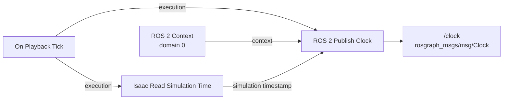
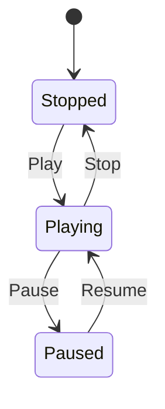
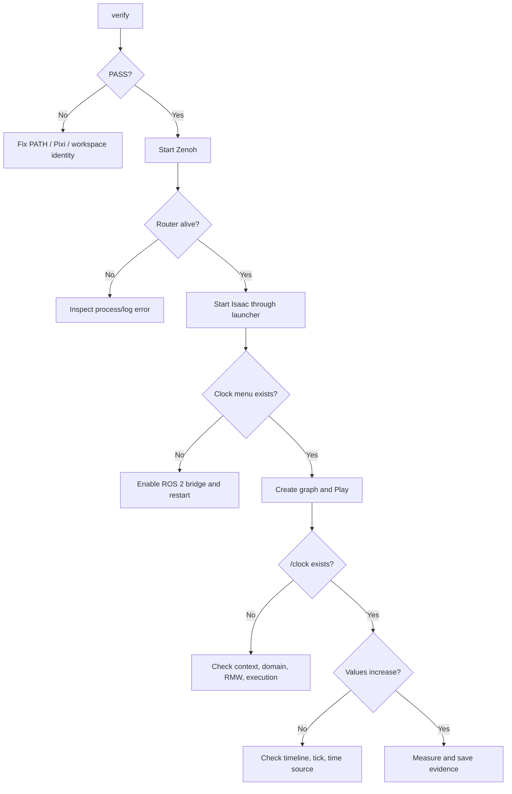

# Reproduce the Isaac Sim GUI → ROS 2 Clock Test on Windows

This lab proves that real simulation data crosses every required boundary on this PC:

```text
Isaac Sim timeline → OmniGraph tick → simulation-time reader
→ ROS 2 Clock publisher → rmw_zenoh_cpp → Zenoh router → ROS 2 Jazzy CLI
```

It does **not** use WSL 2. Keep WSL closed so a second ROS graph cannot confuse the result.

- Live illustrated lab: <https://buicongnguyen.github.io/robotics-simulation-engineer/isaac-sim-gui-clock-test.html>
- Five-lab learning path: <https://buicongnguyen.github.io/robotics-simulation-engineer/ros2-labs.html>
- Next after this gate: [Lab 02 — Joint States, TF, and Odometry](lab-02-joint-states-tf.md)
- [NVIDIA ROS 2 Clock tutorial](https://docs.isaacsim.omniverse.nvidia.com/6.0.1/ros2_tutorials/tutorial_ros2_clock.html)
- [NVIDIA Windows/Pixi setup](https://docs.isaacsim.omniverse.nvidia.com/6.0.1/installation/install_ros_other_platforms.html)
- [NVIDIA Isaac Sim ROS Workspaces](https://github.com/isaac-sim/IsaacSim-ros_workspaces)
- [NVIDIA Isaac Sim 6.0.1 ROS 2 tutorial index](https://docs.isaacsim.omniverse.nvidia.com/6.0.1/ros2_tutorials/ros2_landing_page.html)
- [ROS 2 topic inspection](https://docs.ros.org/en/jazzy/Tutorials/Beginner-CLI-Tools/Understanding-ROS2-Topics/Understanding-ROS2-Topics.html)

## What this test proves

| Observation | What it proves | What it does not prove |
|---|---|---|
| `verify` passes | Jazzy, Zenoh, NVIDIA messages, and paths load | Isaac is publishing |
| Zenoh stays running | Discovery/transport service exists | Publisher and subscriber agree |
| `/clock` appears | Graph discovery reached the publisher | Time advances |
| `/clock` increases | Timeline, graph, bridge, transport, and CLI work | Robot control, sensors, or sim-to-real |
| `ros2 topic hz /clock` is stable | Continuous measurable delivery | Rate equals physics frequency |

Simulation time is the first useful integration signal. ROS nodes with `use_sim_time=true` synchronize timers, TF queries, sensor stamps, bags, and controllers to the simulator instead of wall time.

## Known machine contract

```yaml
operating_system: Windows 11
uses_wsl: false
isaac_sim: C:\isaacsim-6.0.1
ros_distribution: jazzy
workspace: C:\IsaacSim-ros_workspaces\jazzy_ws
rmw_implementation: rmw_zenoh_cpp
ros_domain_id: 0
launcher: C:\Users\n\source\repos\issac_sim\robotics-simulation-engineer\Start-IsaacRosJazzy.ps1
```

Use the launcher for every command. It removes conflicting Miniconda and Cognex DLL directories only from its child process; it does not change the machine globally.

## Before opening three terminals

1. Save other Isaac Sim work.
2. Close old Isaac Sim, Kit, Pixi, ROS, and `rmw_zenohd` processes.
3. Do not source Conda, a global ROS install, or a WSL workspace.
4. Confirm NVIDIA's EULA has already been accepted.
5. Open three fresh **PowerShell** windows.

Set this in each terminal:

```powershell
$Launcher = "C:\Users\n\source\repos\issac_sim\robotics-simulation-engineer\Start-IsaacRosJazzy.ps1"
```

## Step 0 — environment preflight

In Terminal 3:

```powershell
pwsh -NoProfile -ExecutionPolicy Bypass -File $Launcher verify
```

Continue only when the final line is:

```text
PASS: Jazzy, Zenoh, and NVIDIA custom interfaces load in a clean process.
```

Debug environment identity before simulator, discovery, graph, or message data.

## Step 1 — Terminal 1: start Zenoh

```powershell
pwsh -NoProfile -ExecutionPolicy Bypass -File $Launcher zenoh
```

Leave it running. Zenoh is the routing/discovery layer selected by the Pixi Jazzy workspace.

## Step 2 — Terminal 2: start Isaac Sim

```powershell
pwsh -NoProfile -ExecutionPolicy Bypass -File $Launcher sim
```

Wait until the GUI is responsive. Do not launch `C:\isaacsim-6.0.1\python.bat` from inside Pixi: that mixes Python/CUDA/Torch runtimes and previously caused a `c10_cuda.dll` conflict on this PC.

If ROS 2 menus are absent, open **Window → Extensions**, search for `isaacsim.ros2.bridge`, enable it, and restart through the launcher.

## Step 3 — create the Clock Action Graph

1. Choose **Tools → Robotics → ROS 2 OmniGraphs → Clock**.
2. Use graph path `/ROS2Clock` unless it already exists.
3. Confirm the dialog.
4. Open **Window → Graph Editors → Action Graph** if the graph is not visible.
5. Select `/ROS2Clock` in the Stage tree and inspect it.



The visual layout can differ, but the contracts must exist:

- playback tick owns execution;
- ROS 2 Context owns the domain/environment;
- Isaac Read Simulation Time owns the timestamp;
- ROS 2 Publish Clock writes `/clock`.

Keep **simulation time**, not system time. System time could make transport look healthy while hiding a broken simulator-time contract.

## Step 4 — Play and inspect from Terminal 3

Press **Play**, then run:

```powershell
pwsh -NoProfile -ExecutionPolicy Bypass -File $Launcher ros2 topic list
pwsh -NoProfile -ExecutionPolicy Bypass -File $Launcher ros2 topic type /clock
pwsh -NoProfile -ExecutionPolicy Bypass -File $Launcher ros2 topic info /clock --verbose
pwsh -NoProfile -ExecutionPolicy Bypass -File $Launcher ros2 topic echo /clock --once
```

Expected essentials:

```text
/clock
/parameter_events
/rosout

rosgraph_msgs/msg/Clock
```

A valid sample resembles:

```yaml
clock:
  sec: 0
  nanosec: 66666666
---
```

Run the one-message command several times. Time must increase while Play is active. Then measure continuity:

```powershell
pwsh -NoProfile -ExecutionPolicy Bypass -File $Launcher ros2 topic hz /clock
```

Collect at least 20 messages, press `Ctrl+C`, and record average, min, max, standard deviation, and sample count. Do not assume ROS publication rate equals physics frequency; graph ticks, rendering, workload, and real-time factor affect wall-clock arrival.

## Step 5 — prove lifecycle behavior



| GUI state | Expected `/clock` behavior |
|---|---|
| Play | Samples arrive and values increase |
| Pause | Publication/value progression stops |
| Resume | Progression resumes |
| Stop | Graph execution stops |
| Play again | Time resumes; reset depends on `resetOnStop` |

The time reader defaults to monotonic time across stop/replay to prevent backward jumps. Set `resetOnStop=true` only when an experiment requires episode time to restart and all consumers tolerate the jump.

## Step 6 — save evidence

Save the stage as:

```text
C:\Users\n\source\repos\issac_sim\projects\ros2_clock\ros2_clock.usd
```

Save beside it:

- simulator version/build and launch command;
- workspace Git commit;
- ROS distribution, RMW, and domain ID;
- screenshot of the Clock Action Graph;
- topic list, type, and verbose info;
- two increasing clock samples;
- measured clock rate;
- warnings and clean-shutdown result.

## Debug the first broken boundary



| Symptom | First layer | Correction |
|---|---|---|
| `_rclpy_pybind11` or DLL error | Environment | Close shell; use launcher |
| Zenoh exits | Transport | Read first error; stop stale router |
| ROS menu missing | Bridge | Enable `isaacsim.ros2.bridge`; restart |
| Only system topics appear | Publisher graph | Create Clock graph; Play |
| `/clock` exists but echo waits | Execution/QoS | Check timeline, tick, publisher, QoS |
| Values repeat/freeze | Time source/lifecycle | Use simulation time; confirm Play |
| Unexpected topics | Isolation | Stop other Isaac/ROS/WSL sessions |

## Clean shutdown

1. Stop the timeline.
2. Save the USD and evidence.
3. Close Isaac Sim and wait for Terminal 2 to return.
4. Press `Ctrl+C` in Terminal 1.
5. Close all three terminals.

The lab passes only when `/clock` is discovered, has type `rosgraph_msgs/msg/Clock`, produces increasing simulation timestamps during Play, reacts correctly to Pause/Stop, and shuts down cleanly.

## Verified automated fallback on this PC

NVIDIA's bounded standalone clock example was already tested with the consistent Pixi Python runtime. It exited cleanly and a separate Windows Jazzy CLI received:

```yaml
clock:
  sec: 0
  nanosec: 66666666
---
```

That proves the runtime and bridge. The GUI lab adds the saved Action Graph, lifecycle observations, screenshot, and rate evidence needed for a portfolio-quality reproduction.

## Next lesson

After this lab’s gate passes, continue to [Lab 02 — TurtleBot Joint States, TF, and Odometry](lab-02-joint-states-tf.md). Do not skip the Clock gate: every later state, command, image, and bag depends on explicit simulation-time ownership.
