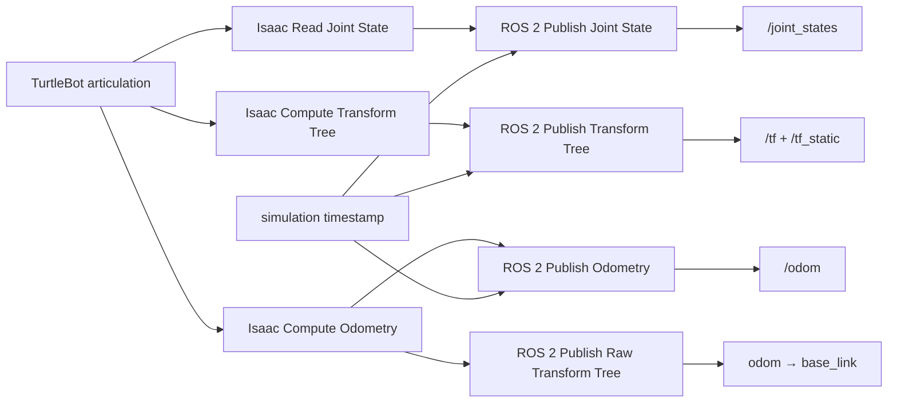
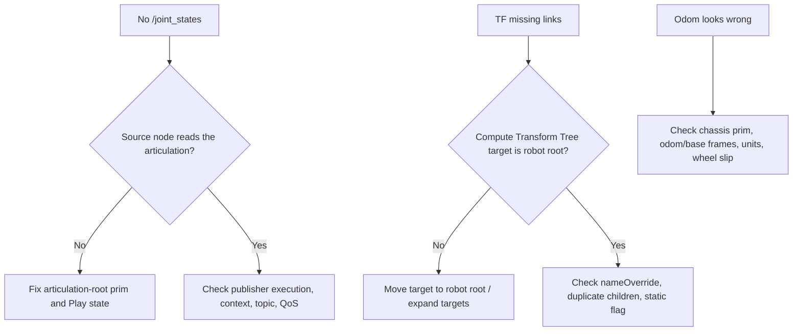

# Lab 02 — TurtleBot Joint States, TF, and Odometry

- **Prerequisite:** Lab 01 passes and `/clock` advances.
- **Goal:** connect an articulated robot’s internal state to ROS schemas and frames.
- **Pass:** joint arrays are structurally valid, TF is connected and acyclic, timestamps advance in simulation time, and odometry uses the declared `odom → base_link` relationship.

- Live page: <https://buicongnguyen.github.io/robotics-simulation-engineer/lab-02-joint-states-tf.html>
- [NVIDIA Windows Jazzy/Pixi + Zenoh configuration](https://docs.isaacsim.omniverse.nvidia.com/6.0.1/installation/install_ros_other_platforms.html)
- [NVIDIA Isaac Sim ROS Workspaces](https://github.com/isaac-sim/IsaacSim-ros_workspaces)
- [NVIDIA TF and odometry tutorial](https://docs.isaacsim.omniverse.nvidia.com/6.0.1/ros2_tutorials/tutorial_ros2_tf.html)
- [Isaac Sim 6.0 OmniGraph migration](https://docs.isaacsim.omniverse.nvidia.com/6.0.1/migration_guides/isaac_sim_6_0/ros2_omnigraph_migration.html)

## Why this comes after `/clock`

Joint positions without a trustworthy timestamp cannot be aligned with commands or images. TF without a timestamp cannot answer “where was this frame when the measurement was acquired?” Lab 02 therefore extends the Clock contract rather than starting a separate system.



## Step 1 — start the known Windows contract

Use the three-terminal sequence from Lab 01. In Terminal 3:

```powershell
$Launcher = "C:\Users\n\source\repos\issac_sim\robotics-simulation-engineer\Start-IsaacRosJazzy.ps1"
pwsh -NoProfile -ExecutionPolicy Bypass -File $Launcher verify
pwsh -NoProfile -ExecutionPolicy Bypass -File $Launcher ros2 topic list
```

Do not continue if environment identity or `/clock` fails.

## Step 2 — open the fast-track TurtleBot scene

In Isaac Sim Content Browser open:

```text
Isaac Sim > Samples > ROS2 > Scenario > turtlebot_tutorial.usd
```

Wait for assets and shaders to finish loading. Press Play. If this sample is unavailable, complete NVIDIA's URDF Import: TurtleBot tutorial and use the imported robot; record the actual robot and articulation-root prim paths.

Do not add duplicate publishers if the sample already contains them. First inspect its Action Graphs and Stage tree.

## Step 3 — understand the Isaac Sim 6.0 graph

Isaac Sim 6.0 separates data acquisition from ROS publication. Older tutorials may show direct `targetPrim` inputs; for new graphs use:

| Source node | ROS publisher | Required connections |
|---|---|---|
| Isaac Read Joint State | ROS2 Publish Joint State | `execOut`, names, positions, velocities, efforts, DOF types, scale, sensor time |
| Isaac Compute Transform Tree | ROS2 Publish Transform Tree | execution, parent/child frames, translations, orientations |
| Isaac Compute Odometry | ROS2 Publish Odometry | pose and full 3D linear/angular velocity; set `odomFrameId=odom` and `chassisFrameId=base_link` |
| Isaac Compute Odometry | ROS2 Publish Raw Transform Tree | translation/orientation for the dynamic `odom → base_link` transform |

Feed Isaac Read Simulation Time into every publisher timestamp. The odometry message does not create the corresponding TF edge by itself; the Raw Transform Tree publisher owns that edge.

Robot-wide state graphs belong at the robot root. For the shipped processed TurtleBot, NVIDIA documents the main robot prim as `/World/tb3_burger_processed` and the articulation root under `Geometry/base_footprint/base_link`. Verify the actual stage before copying a path.

## Step 4 — inspect the ROS contract

```powershell
pwsh -NoProfile -ExecutionPolicy Bypass -File $Launcher ros2 topic list -t
pwsh -NoProfile -ExecutionPolicy Bypass -File $Launcher ros2 topic echo /joint_states --once
pwsh -NoProfile -ExecutionPolicy Bypass -File $Launcher ros2 topic echo /tf --once
pwsh -NoProfile -ExecutionPolicy Bypass -File $Launcher ros2 topic echo /tf_static --once  # only when a static publisher is configured
pwsh -NoProfile -ExecutionPolicy Bypass -File $Launcher ros2 topic echo /odom --once
```

Then measure publisher identity and rates:

```powershell
pwsh -NoProfile -ExecutionPolicy Bypass -File $Launcher ros2 topic info /joint_states --verbose
pwsh -NoProfile -ExecutionPolicy Bypass -File $Launcher ros2 topic hz /joint_states
pwsh -NoProfile -ExecutionPolicy Bypass -File $Launcher ros2 topic hz /odom
```

Collect at least 20 messages for each rate command.

## Step 5 — apply the invariants

For one JointState sample:

```text
len(name) == len(position)
velocity is empty OR len(velocity) == len(name)
effort is empty OR len(effort) == len(name)
joint names are unique
all numeric values are finite
header timestamp does not move backward inside one episode
```

For TF:

```text
each child has one parent
no cycles
frame names are stable
odom → base_link is dynamic
sensor mounting transforms have one declared owner; use /tf_static when deliberately configured as static
```

Optional if `tf2_tools` is present:

```powershell
pwsh -NoProfile -ExecutionPolicy Bypass -File $Launcher ros2 run tf2_tools view_frames
```

## Step 6 — lifecycle experiment

1. Record one joint and odometry sample while playing.
2. Pause Isaac Sim; bounded echoes should wait because no new samples execute.
3. Resume; timestamps and values continue.
4. Drive the robot later in Lab 03 and verify wheel joints and odometry change together.

## Debugging decision



| Symptom | First boundary | Likely cause |
|---|---|---|
| Names but empty positions | source schema | wrong articulation/DOF source |
| Array lengths differ | source-to-publisher wiring | partially connected 6.0 graph |
| TF has two parents for one child | ownership | duplicate TF publisher |
| TF extrapolation | time | mixed wall/simulation time or stale consumer |
| Odom moves while robot does not | frame/source | wrong chassis prim or ground-truth misuse |

## Evidence to save

- robot and articulation-root prim paths;
- screenshot of joint, TF, and odometry graph boundaries;
- one complete JointState sample and array-length table;
- TF diagram with dynamic/static labels;
- topic type/QoS/publisher information;
- rate measurements in simulation time and wall arrival time;
- one diagnosed failure and correction.

## Gate

Continue to Lab 03 only when `/clock`, `/joint_states`, `/tf`, and `/odom` are observable; joint arrays satisfy the invariants; TF is connected/acyclic; and both `/odom` and the dynamic `odom → base_link` edge use consistent frames. Require `/tf_static` only if this stage deliberately contains a static TF publisher.
