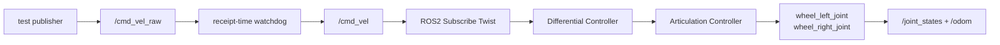
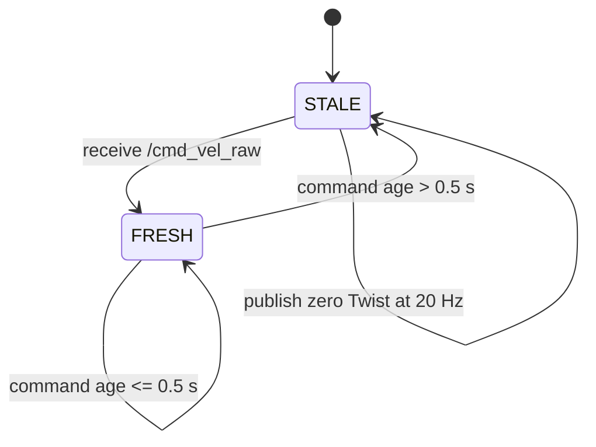

# Lab 03 — Drive TurtleBot with `/cmd_vel` and a Watchdog

- **Prerequisite:** Lab 02 state and TF gate passes.
- **Goal:** trace a velocity command from ROS receipt to wheel actuation, then prove stale input reaches a safe zero command.
- **Pass:** fresh commands move the robot in the expected direction and stopping `/cmd_vel_raw` produces zero `/cmd_vel` within the declared timeout plus one publish period.

- Live page: <https://buicongnguyen.github.io/robotics-simulation-engineer/lab-03-cmd-vel-watchdog.html>
- [NVIDIA Windows Jazzy/Pixi + Zenoh configuration](https://docs.isaacsim.omniverse.nvidia.com/6.0.1/installation/install_ros_other_platforms.html)
- [NVIDIA Isaac Sim ROS Workspaces](https://github.com/isaac-sim/IsaacSim-ros_workspaces)
- [NVIDIA Driving TurtleBot with ROS 2](https://docs.isaacsim.omniverse.nvidia.com/6.0.1/ros2_tutorials/tutorial_ros2_drive_turtlebot.html)
- Downloadable watchdog: [lab-assets/cmd_vel_watchdog.py](lab-assets/cmd_vel_watchdog.py)

## Command data flow



`geometry_msgs/msg/Twist` has no header timestamp. The watchdog therefore measures time since local receipt using a monotonic/steady clock. This is deliberate: if simulation time pauses, a safety stop should not wait forever for `/clock` to advance.

## Step 1 — open the same robot scene

Start Zenoh, Isaac Sim, and the ROS CLI exactly as in Labs 01–02. Open:

```text
Isaac Sim > Samples > ROS2 > Scenario > turtlebot_tutorial.usd
```

Press Play and confirm `/clock`, `/joint_states`, and `/odom` before testing commands.

## Step 2 — inspect the subscriber/controller graph

The functional chain should contain:

1. On Playback Tick or equivalent execution owner.
2. ROS2 Context using domain 0 from the environment.
3. ROS2 Subscribe Twist with topic `/cmd_vel`.
4. Differential Controller converting linear/angular body velocity to left/right wheel velocities.
5. Make Array with token values `wheel_left_joint` and `wheel_right_joint`.
6. Articulation Controller targeting the TurtleBot articulation.

Record the actual wheel joint names from `/joint_states`; never assume names when importing a different robot.

## Step 3 — prove direct motion first

Use a bounded one-shot forward command:

```powershell
$Launcher = "C:\Users\n\source\repos\issac_sim\robotics-simulation-engineer\Start-IsaacRosJazzy.ps1"
pwsh -NoProfile -ExecutionPolicy Bypass -File $Launcher ros2 topic pub --once /cmd_vel geometry_msgs/msg/Twist "{linear: {x: 0.2}, angular: {z: 0.0}}"
```

Then stop explicitly:

```powershell
pwsh -NoProfile -ExecutionPolicy Bypass -File $Launcher ros2 topic pub --once /cmd_vel geometry_msgs/msg/Twist "{linear: {x: 0.0}, angular: {z: 0.0}}"
```

Verify `/joint_states` wheel velocities and `/odom` change consistently. If the robot moves backward, do not flip commands immediately: first check wheel axes, joint order, drive direction, and body-frame convention.

## Step 4 — insert the watchdog

Terminal 3 runs the supplied node:

```powershell
pwsh -NoProfile -ExecutionPolicy Bypass -File $Launcher python "C:\Users\n\source\repos\issac_sim\robotics-simulation-engineer\lab-assets\cmd_vel_watchdog.py" --input /cmd_vel_raw --output /cmd_vel --timeout 0.5 --rate 20
```

Terminal 4 observes the safe output:

```powershell
pwsh -NoProfile -ExecutionPolicy Bypass -File $Launcher ros2 topic echo /cmd_vel
```

Terminal 5 sends a fresh command stream:

```powershell
pwsh -NoProfile -ExecutionPolicy Bypass -File $Launcher ros2 topic pub -r 10 /cmd_vel_raw geometry_msgs/msg/Twist "{linear: {x: 0.2}, angular: {z: 0.0}}"
```

The robot should move forward. Press `Ctrl+C` only in Terminal 5. Within approximately `0.5 s + 0.05 s`, the watchdog must publish zero Twist and the robot must decelerate to rest according to its joint drives and contact physics.

## Step 5 — exercise the watchdog state machine



Run four cases:

| Case | Raw command | Expected safe output/behavior |
|---|---|---|
| Forward | `x=0.2, z=0` at 10 Hz | robot advances; wheel signs follow model convention |
| Turn | `x=0, z=0.5` at 10 Hz | opposite/different wheel speeds; yaw changes |
| Stop stream | publisher terminated | zero Twist within bound |
| Pause simulator | no physics progression | watchdog still becomes stale on steady time; zero waits at subscriber until execution resumes |

## Step 6 — separate command receipt from physical response

Measure these boundaries independently:

```text
t_receive_raw
t_publish_safe
t_subscriber_graph_executes
t_wheel_target_changes
t_joint_velocity_near_zero
```

The watchdog gate concerns `t_publish_safe - t_last_receive`. The robot’s stopping distance additionally depends on actuator dynamics, friction, controller gains, and physics timestep.

## Debugging decisions

| Symptom | First check | Likely correction |
|---|---|---|
| `/cmd_vel` exists but robot does not move | subscriber count and Play | connect subscriber execution/context; press Play |
| Targets change but wheels do not | articulation controller | target prim, joint tokens, drive mode, limits |
| Robot moves backward | joint convention | axis/direction/order; do not hide with arbitrary sign flip |
| Robot never stops | watchdog output | confirm raw/output topics differ and graph subscribes to safe output |
| Watchdog stops immediately | input rate/timeout | publish faster than timeout; inspect receipt logs |
| Zero command arrives but robot coasts | dynamics | damping, friction, gain, torque/velocity drive behavior |

## Evidence to save

- subscriber/controller graph screenshot;
- direct forward/turn/zero command transcript;
- wheel-joint and odometry response samples;
- watchdog parameters and logs;
- measured stale-to-zero time;
- observed time to physical rest;
- one deliberate wrong-joint or stale-command failure and diagnosis.

## Gate

Continue to Lab 04 only when fresh commands produce the expected motion, wheel/odometry evidence agrees, and loss of `/cmd_vel_raw` reliably produces a zero safe output within the declared bound.
