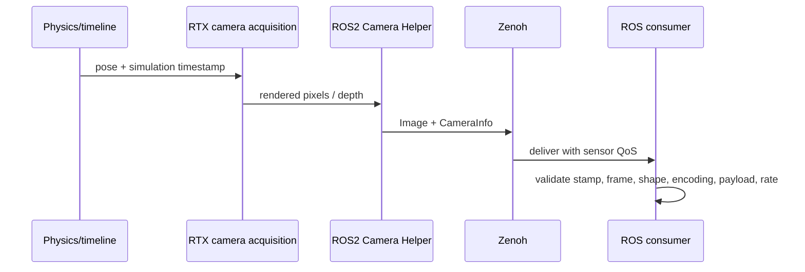
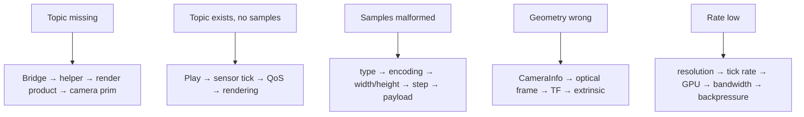

# Lab 04 — Publish and Validate RGB/Depth Camera Data

- **Prerequisite:** Lab 03 command watchdog gate passes.
- **Goal:** publish perception data whose schema, optical frame, acquisition timestamp, cadence, and payload can be defended.
- **Pass:** at least one RGB or depth Image message passes the supplied probe, CameraInfo matches the image geometry/frame, timestamps use simulation time, and measured rate/bandwidth are recorded.

- Live page: <https://buicongnguyen.github.io/robotics-simulation-engineer/lab-04-camera-depth.html>
- [NVIDIA ROS 2 Cameras](https://docs.isaacsim.omniverse.nvidia.com/6.0.1/ros2_tutorials/tutorial_ros2_camera.html)
- [NVIDIA Publishing Camera Data](https://docs.isaacsim.omniverse.nvidia.com/6.0.1/ros2_tutorials/tutorial_ros2_camera_publishing.html)
- Downloadable probe: [lab-assets/camera_probe.py](lab-assets/camera_probe.py)

## Perception data flow



An image topic being visible proves discovery only. A useful image also requires a coherent optical frame, acquisition timestamp, encoding, dimensions, row stride, payload size, calibration, QoS, and sustainable delivery rate.

## Step 1 — use the TurtleBot scenario

Open the same shipped scene:

```text
Isaac Sim > Samples > ROS2 > Scenario > turtlebot_tutorial.usd
```

NVIDIA documents this scene as an example with multiple camera ROS topics. Inspect the camera prim, render product, and each Camera Helper rather than adding duplicate publishers.

If building manually, add a camera to the robot, then use the ROS 2 camera publishing shortcut/helper. Each Camera Helper publishes one data type, so RGB, depth, point cloud, and CameraInfo may require separate helper nodes.

## Step 2 — discover actual topic names and types

```powershell
$Launcher = "C:\Users\n\source\repos\issac_sim\robotics-simulation-engineer\Start-IsaacRosJazzy.ps1"
pwsh -NoProfile -ExecutionPolicy Bypass -File $Launcher ros2 topic list -t | Select-String -Pattern "camera|image|depth|point"
```

Common sample names include `/camera_1/rgb/image_raw` and `/camera_1/rgb/camera_info`, but use the actual output from your stage.

For the chosen image topic:

```powershell
pwsh -NoProfile -ExecutionPolicy Bypass -File $Launcher ros2 topic type /camera_1/rgb/image_raw
pwsh -NoProfile -ExecutionPolicy Bypass -File $Launcher ros2 topic info /camera_1/rgb/image_raw --verbose
pwsh -NoProfile -ExecutionPolicy Bypass -File $Launcher ros2 topic echo /camera_1/rgb/camera_info --once
```

Expected uncompressed image type: `sensor_msgs/msg/Image`.

## Step 3 — run a bounded payload probe

```powershell
pwsh -NoProfile -ExecutionPolicy Bypass -File $Launcher python "C:\Users\n\source\repos\issac_sim\robotics-simulation-engineer\lab-assets\camera_probe.py" --topic /camera_1/rgb/image_raw --timeout 15
```

The JSON report must show:

```text
ok: true
width > 0
height > 0
step > 0
payload_bytes >= step * height
non-empty encoding
non-empty optical frame_id
timestamp advances with /clock
```

Run it again for a depth Image topic after discovering the real name. Record the depth encoding and units from the official annotator/reference; do not infer metric units from the numeric range alone.

## Step 4 — validate geometry and frame semantics

For `sensor_msgs/Image`, the optical-frame convention is:

```text
+x → image right
+y → image down
+z → forward through the image plane
```

Check:

1. Image and associated CameraInfo use the same `frame_id`.
2. Image width/height match CameraInfo width/height.
3. CameraInfo intrinsic matrix corresponds to the current resolution.
4. TF contains the camera optical frame under the intended robot link.
5. A known object moved right/left in the scene moves consistently in the image.
6. A known-distance target produces plausible depth before noise is added.

## Step 5 — measure cadence and capacity

```powershell
pwsh -NoProfile -ExecutionPolicy Bypass -File $Launcher ros2 topic hz /camera_1/rgb/image_raw
pwsh -NoProfile -ExecutionPolicy Bypass -File $Launcher ros2 topic bw /camera_1/rgb/image_raw
pwsh -NoProfile -ExecutionPolicy Bypass -File $Launcher ros2 topic hz /camera_1/rgb/camera_info
```

Collect at least 30 samples. In Isaac Sim 6.0, Camera Helper `frameSkipCount` is deprecated. Camera scheduling uses the camera prim’s `omni:sensor:tickRate`; do not “fix” a rate by changing only a legacy field.

Wall-arrival rate may be below requested sensor rate when rendering, image size, GPU workload, serialization, transport, or subscriber backpressure is the capacity bottleneck.

## Step 6 — controlled isolation experiment

Change one variable at a time and restore it after measurement:

| Experiment | Keep fixed | Observe |
|---|---|---|
| halve resolution | scene, camera pose, tick rate | bandwidth, wall rate, GPU load |
| halve tick rate | resolution and scene | message rate and timestamp interval |
| disable depth helper | RGB configuration | GPU/transport capacity |
| pause/resume | graph and sensor settings | timestamp/lifecycle behavior |

Do not combine these changes; otherwise you cannot attribute the result.

## Debugging decisions



## Evidence to save

- camera prim and render-product/helper screenshot;
- discovered topic/type/QoS table;
- RGB and depth probe JSON;
- CameraInfo and optical-frame/TF check;
- rate and bandwidth samples;
- controlled resolution or tick-rate comparison;
- one malformed/missing/slow-data diagnosis.

## Gate

Continue to Lab 05 only when RGB or depth payload validation passes, CameraInfo and TF agree, timestamps follow simulation time, and the achieved rate/bandwidth are measured rather than assumed.
