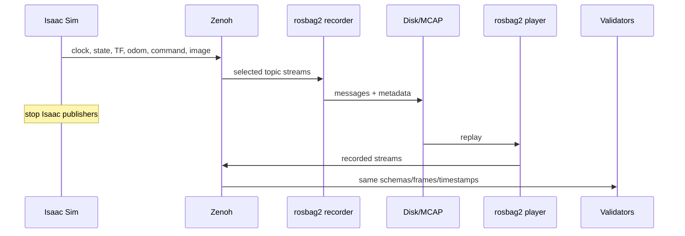
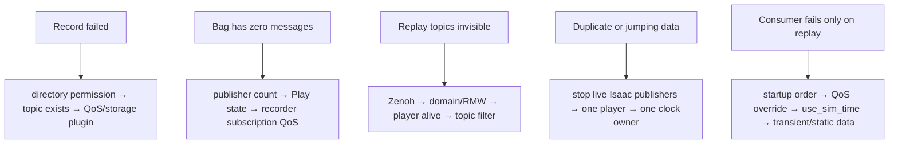

# Lab 05 — Record, Replay, and Validate the ROS Pipeline

- **Prerequisite:** Labs 01–04 pass.
- **Goal:** capture the interface contract and prove useful analysis can run again without live Isaac Sim publishers.
- **Pass:** rosbag metadata contains the declared topics/types and replay reproduces observable message/schema/frame/timestamp analysis with Isaac Sim stopped.

- Live page: <https://buicongnguyen.github.io/robotics-simulation-engineer/lab-05-rosbag-validation.html>
- [NVIDIA Windows Jazzy/Pixi + Zenoh configuration](https://docs.isaacsim.omniverse.nvidia.com/6.0.1/installation/install_ros_other_platforms.html)
- [NVIDIA Isaac Sim ROS Workspaces](https://github.com/isaac-sim/IsaacSim-ros_workspaces)
- [ROS 2 Jazzy command-line tools](https://docs.ros.org/en/jazzy/Concepts/Basic/About-Command-Line-Tools.html)
- [ROS 2 replay testing](https://docs.ros.org/en/jazzy/p/replay_testing/)

This PC’s Windows Pixi environment was checked on 3 August 2026 and exposes `ros2 bag record`, `info`, `play`, `convert`, `reindex`, and `burst`.

## What a bag can and cannot prove

| Bag evidence can reconstruct | It cannot reconstruct by itself |
|---|---|
| topic names and message types | hidden simulator configuration |
| message payloads and recorded timestamps | contact solver state not published |
| recorded TF and command streams | a new physical simulation outcome |
| arrival/order characteristics in the recording | real robot performance |
| offline consumer behavior under replay | unrecorded parameters/assets/random seeds |

The correct claim is “message-contract analysis is reproducible,” not “the simulator reran identically.”

## End-to-end sequence



## Step 1 — declare the recording contract

Before recording, save this manifest and replace camera names with discovered topics:

```yaml
required_topics:
  - /clock
  - /joint_states
  - /tf
  - /tf_static
  - /odom
  - /cmd_vel
  - /camera_1/rgb/image_raw
  - /camera_1/rgb/camera_info
required_behaviors:
  clock_monotonic: true
  joint_arrays_valid: true
  tf_connected_acyclic: true
  watchdog_zero_observed: true
  image_probe_ok: true
```

Do not use `ros2 bag record -a` for the primary artifact. An explicit topic list prevents accidental collection of irrelevant or sensitive topics and makes the contract reviewable.

Create `lab-assets/rosbag_qos_overrides.yaml` and use it for bandwidth-heavy sensor topics and transient-local static transforms. QoS overrides are part of the experiment contract, not an afterthought.

## Step 2 — prepare a bounded output directory

```powershell
$Launcher = "C:\Users\n\source\repos\issac_sim\robotics-simulation-engineer\Start-IsaacRosJazzy.ps1"
$RunRoot = "C:\Users\n\source\repos\issac_sim\projects\ros2_pipeline\runs"
$Bag = Join-Path $RunRoot ("lab05_" + (Get-Date -Format "yyyyMMdd_HHmmss"))
New-Item -ItemType Directory -Force -Path $RunRoot | Out-Null
```

Check all required topics and types before recording:

```powershell
pwsh -NoProfile -ExecutionPolicy Bypass -File $Launcher ros2 topic list -t
```

## Step 3 — record one controlled episode

In a dedicated terminal:

```powershell
pwsh -NoProfile -ExecutionPolicy Bypass -File $Launcher ros2 bag record -o $Bag --qos-profile-overrides-path "C:\Users\n\source\repos\issac_sim\robotics-simulation-engineer\lab-assets\rosbag_qos_overrides.yaml" /clock /joint_states /tf /tf_static /odom /cmd_vel /camera_1/rgb/image_raw /camera_1/rgb/camera_info
```

While recording:

1. Keep the simulator playing for at least 10 seconds.
2. Publish a forward command through `/cmd_vel_raw` for 2 seconds.
3. Stop the raw publisher and wait for the watchdog’s zero command.
4. Rotate or move through a visually observable scene region.
5. Pause and resume once only if you intend to test lifecycle behavior.
6. Press `Ctrl+C` in the recorder terminal and wait for metadata to flush.

Do not kill the recorder process; an unclean stop can leave metadata incomplete.

## Step 4 — inspect before replay

```powershell
pwsh -NoProfile -ExecutionPolicy Bypass -File $Launcher ros2 bag info $Bag
Get-ChildItem -LiteralPath $Bag
```

Confirm:

- storage and metadata files exist;
- duration is greater than zero;
- every declared topic has the expected type;
- message counts are nonzero except an intentionally transient topic;
- the bag size is plausible for the image resolution/duration.

If metadata is damaged after an abnormal stop, preserve the original and use `ros2 bag reindex` on a copy; document the recovery.

## Step 5 — isolate live publishers before replay

1. Stop and close Isaac Sim.
2. Stop the command publisher and watchdog.
3. Keep one Zenoh router running.
4. Confirm the live graph no longer contains Isaac publishers.

```powershell
pwsh -NoProfile -ExecutionPolicy Bypass -File $Launcher ros2 topic info /joint_states --verbose
```

The publisher count should be zero before replay. This prevents recorded and live data from interleaving.

## Step 6 — replay and validate in separate terminals

Replay terminal:

```powershell
pwsh -NoProfile -ExecutionPolicy Bypass -File $Launcher ros2 bag play $Bag --qos-profile-overrides-path "C:\Users\n\source\repos\issac_sim\robotics-simulation-engineer\lab-assets\rosbag_qos_overrides.yaml" --topics /clock /joint_states /tf /tf_static /odom /cmd_vel /camera_1/rgb/image_raw /camera_1/rgb/camera_info
```

Observer terminal:

```powershell
pwsh -NoProfile -ExecutionPolicy Bypass -File $Launcher ros2 topic echo /joint_states --once
pwsh -NoProfile -ExecutionPolicy Bypass -File $Launcher ros2 topic echo /odom --once
pwsh -NoProfile -ExecutionPolicy Bypass -File $Launcher ros2 topic hz /camera_1/rgb/image_raw
```

Camera contract probe during replay:

```powershell
pwsh -NoProfile -ExecutionPolicy Bypass -File $Launcher python "C:\Users\n\source\repos\issac_sim\robotics-simulation-engineer\lab-assets\camera_probe.py" --topic /camera_1/rgb/image_raw --samples 5 --timeout 15
```

Replay may finish before a late observer starts. Start observers first and use rosbag play options such as looping or a delayed start only after reading `ros2 bag play --help` for the installed version.

## Step 7 — validate reproducibility boundaries

Run the same checks used in earlier labs:

```text
Lab 01: clock timestamps appear and do not move backward in the episode
Lab 02: JointState arrays remain structurally valid; TF frame names/types persist
Lab 03: recorded /cmd_vel contains fresh commands and the watchdog zero
Lab 04: image schema/payload/frame probe passes
```

Compare live versus replay results in a table. Differences in wall-arrival rate during replay are expected unless playback rate and machine load are controlled; message timestamps and schemas are the primary reproducibility contract.

## Debugging decision tree



| Symptom | First boundary | Correction |
|---|---|---|
| Image missing from bag | QoS/capacity | inspect recorder subscription and bandwidth; reduce resolution if needed |
| `/tf_static` unavailable to late consumer | durability/startup | inspect QoS and start consumer before/with replay |
| Two `/clock` publishers | ownership | stop Isaac or remove duplicate playback source |
| Replay ends before probe receives | sequencing | start probe first; loop replay for diagnosis |
| Bag huge | scope/rate | explicit topics, shorter episode, resolution/tick contract |

## Portfolio evidence

- recording manifest and exact command;
- `ros2 bag info` output;
- bag metadata, duration, size, topic types, and counts;
- screenshot/log proving Isaac publishers were stopped before replay;
- replay JointState/odom samples and camera probe JSON;
- live-versus-replay contract table;
- failure/recovery note;
- README stating what replay does and does not prove.

Keep large bag data out of Git unless deliberately managed with an appropriate artifact store. Commit the small manifest, report, plots, and scripts.

## Final gate

Lab 05 passes when another engineer can launch the documented Windows environment, reproduce the clock/state/control/camera contracts, inspect the bag metadata, replay the selected topics with Isaac Sim stopped, and obtain the same schema/frame/timestamp conclusions. Continue to [Lab 06](lab-06-urdf-model-audit.md) to audit the robot model before physics tuning.
