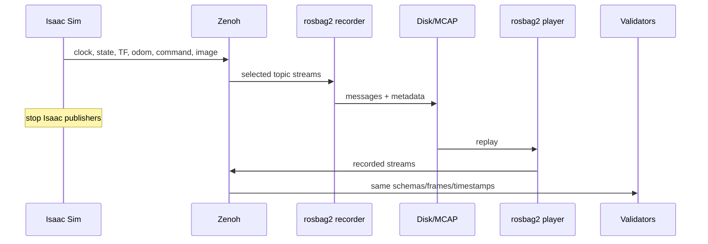
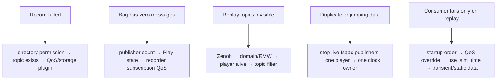

# Lab 05 — Record, Replay, and Validate the ROS Pipeline

- **Prerequisite:** Labs 01–04 pass.
- **Goal:** capture the interface contract and prove useful analysis can run again without live Isaac Sim publishers.
- **Pass:** rosbag metadata contains the declared topics/types, the offline bag checker reproduces the Lab 01–04 contracts, and replay reproduces observable message/schema/frame/timestamp analysis with Isaac Sim stopped.

- Live page: <https://buicongnguyen.github.io/robotics-simulation-engineer/lab-05-rosbag-validation.html>
- [NVIDIA Windows Jazzy/Pixi + Zenoh configuration](https://docs.isaacsim.omniverse.nvidia.com/6.0.1/installation/install_ros_other_platforms.html)
- [NVIDIA Isaac Sim ROS Workspaces](https://github.com/isaac-sim/IsaacSim-ros_workspaces)
- [ROS 2 Jazzy command-line tools](https://docs.ros.org/en/jazzy/Concepts/Basic/About-Command-Line-Tools.html)
- [ROS 2 replay testing](https://docs.ros.org/en/jazzy/p/replay_testing/)
- Offline checker: [lab-assets/bag_contract_check.py](lab-assets/bag_contract_check.py) with [lab-assets/lab05_bag_manifest.json](lab-assets/lab05_bag_manifest.json)

This PC’s Windows Pixi environment was checked on 3 August 2026 and exposes `ros2 bag record`, `info`, `play`, `convert`, `reindex`, and `burst`.

## What a bag can and cannot prove

| Bag evidence can reconstruct | It cannot reconstruct by itself |
|---|---|
| topic names and message types | hidden simulator configuration |
| message payloads and recorded timestamps | contact solver state not published |
| recorded TF and command streams | a new physical simulation outcome |
| arrival/order characteristics in the recording | real robot performance |
| offline consumer behavior under replay | unrecorded parameters/assets/random seeds |

The correct claim is “message-contract analysis is reproducible,” not “the simulator reran identically.”

## End-to-end sequence



## Step 1 — declare the recording contract

Before recording, copy the committed manifest into your run folder, then replace the camera names with the topics you discovered in Lab 04:

```powershell
Copy-Item "$Assets\lab05_bag_manifest.json" "$Run\bag_manifest.json"
```

The manifest is the contract the offline checker enforces:

| Key | Contract it runs |
|---|---|
| `required_topics` | each topic exists with this exact type and at least one message |
| `/clock` in the list | Lab 01: simulation time never moves backward and does advance |
| `/joint_states` in the list | Lab 02: array lengths, unique names, finite values, stable order, stamps never backward |
| `/tf` or `/tf_static` in the list + `required_tf_edges` | Lab 02: one parent per child, no cycles, one root, `odom → base_link` present |
| `watchdog` | Lab 03: first zero on `/cmd_vel` within `timeout + 1/rate + slack` after the last `/cmd_vel_raw` |
| `image` | Lab 04: the camera probe's image and CameraInfo contracts |

Add `/tf_static` to `required_topics` only if your stage deliberately publishes static transforms (Lab 02).

Do not use `ros2 bag record -a` for the primary artifact. An explicit topic list prevents accidental collection of irrelevant or sensitive topics and makes the contract reviewable.

Use the committed [`lab-assets/rosbag_qos_overrides.yaml`](lab-assets/rosbag_qos_overrides.yaml). Sensor streams commonly use best-effort reliability, while late static-TF consumers need transient-local durability. QoS overrides are part of the experiment contract, not an afterthought.

## Step 2 — prepare a bounded output directory

Use the session variables from [Shared startup](ros2-labs.md#shared-startup). The bag goes inside this attempt's run folder; `ros2 bag record` creates the directory itself and refuses to overwrite an existing one.

```powershell
$Bag = "$Run\lab05_bag"
```

The recorder, replay, and observer terminals in Steps 3–8 each start without these variables. Set the session variables and this same `$Bag` line in each one. Both are fixed paths, not timestamps, so every terminal points at the same bag.

Check all required topics and types before recording:

```powershell
pwsh -NoProfile -ExecutionPolicy Bypass -File $Launcher ros2 topic list -t
```

## Step 3 — record one controlled episode

In a dedicated terminal:

```powershell
pwsh -NoProfile -ExecutionPolicy Bypass -File $Launcher ros2 bag record -o $Bag --qos-profile-overrides-path "$Assets\rosbag_qos_overrides.yaml" --topics /clock /joint_states /tf /tf_static /odom /cmd_vel_raw /cmd_vel /camera_1/rgb/image_raw /camera_1/rgb/camera_info
```

Recording `/cmd_vel_raw` as well as `/cmd_vel` lets the checker measure stale-to-zero latency instead of only seeing that a zero happened.

While recording:

1. Keep the simulator playing for at least 10 seconds.
2. Publish a forward command through `/cmd_vel_raw` for 2 seconds.
3. Stop the raw publisher and wait for the watchdog’s zero command.
4. Rotate or move through a visually observable scene region.
5. Pause and resume once only if you intend to test lifecycle behavior.
6. Press `Ctrl+C` in the recorder terminal and wait for metadata to flush.

Do not kill the recorder process; an unclean stop can leave metadata incomplete.

## Step 4 — inspect before replay

```powershell
pwsh -NoProfile -ExecutionPolicy Bypass -File $Launcher ros2 bag info $Bag
Get-ChildItem -LiteralPath $Bag
```

Confirm:

- storage and metadata files exist;
- duration is greater than zero;
- every declared topic has the expected type;
- message counts are nonzero except an intentionally transient topic;
- the bag size is plausible for the image resolution/duration. An unexpectedly tiny bag often means missing sensor data.

If metadata is damaged after an abnormal stop, preserve the original and use `ros2 bag reindex` on a copy; document the recovery.

## Step 5 — re-run the Lab 01–04 contracts offline

The checker reads the bag directly, so it needs neither Isaac Sim nor a replay:

```powershell
pwsh -NoProfile -ExecutionPolicy Bypass -File $Launcher python "$Assets\bag_contract_check.py" $Bag --manifest "$Run\bag_manifest.json" --output "$Run\bag_contract.json"
```

It exits non-zero unless every declared contract passes. Each entry under `checks` names its own failure, for example `frame 'base_link' has multiple parents` or a `stale_to_zero_s` above `bound_s`. Run it twice on the same bag: the report must be identical, which is the point of recording.

The rules live in `lab_contracts.py` and are unit-tested offline. `tests/ros/test_ros_integration.py` writes real MCAP bags, one clean and three with planted faults (clock jumps backward, a TF child with two parents, a watchdog that never zeroes). It checks that each fault fails only its own contract.

## Step 6 — isolate live publishers before replay

1. Stop and close Isaac Sim.
2. Stop the command publisher and watchdog.
3. Keep one Zenoh router running.
4. Confirm the live graph no longer contains Isaac publishers.

```powershell
pwsh -NoProfile -ExecutionPolicy Bypass -File $Launcher ros2 topic info /joint_states --verbose
```

The publisher count should be zero before replay; if no node uses the topic any more, `ros2 topic info` instead prints `Unknown topic '/joint_states'` and exits nonzero, which also confirms no live publisher. This prevents recorded and live data from interleaving.

## Step 7 — replay and validate consumers in separate terminals

Replay terminal:

```powershell
pwsh -NoProfile -ExecutionPolicy Bypass -File $Launcher ros2 bag play $Bag --qos-profile-overrides-path "$Assets\rosbag_qos_overrides.yaml" --topics /clock /joint_states /tf /tf_static /odom /cmd_vel_raw /cmd_vel /camera_1/rgb/image_raw /camera_1/rgb/camera_info
```

Observer terminal:

```powershell
pwsh -NoProfile -ExecutionPolicy Bypass -File $Launcher ros2 topic echo /joint_states --once
pwsh -NoProfile -ExecutionPolicy Bypass -File $Launcher ros2 topic echo /odom --once
pwsh -NoProfile -ExecutionPolicy Bypass -File $Launcher ros2 topic hz /camera_1/rgb/image_raw
```

Camera contract probe during replay:

```powershell
pwsh -NoProfile -ExecutionPolicy Bypass -File $Launcher python "$Assets\camera_probe.py" --topic /camera_1/rgb/image_raw --camera-info /camera_1/rgb/camera_info --samples 5 --timeout 15 --output "$Run\camera_probe_replay.json"
```

Replay may finish before a late observer starts. Start observers first and use rosbag play options such as looping or a delayed start only after reading `ros2 bag play --help` for the installed version.

## Step 8 — validate reproducibility boundaries

Step 5 already re-ran the Lab 01–04 contracts on the recording. Replay adds the consumer side: the same probe that passed live (`$Run\camera_probe.json`) must pass on replayed data (`$Run\camera_probe_replay.json`).

Compare live versus replay results in a table. Differences in wall-arrival rate during replay are expected unless playback rate and machine load are controlled; message timestamps and schemas are the primary reproducibility contract.

## Debugging decision tree



| Symptom | First boundary | Correction |
|---|---|---|
| Image missing from bag | QoS/capacity | inspect recorder subscription and bandwidth; reduce resolution if needed |
| `/tf_static` unavailable to late consumer | durability/startup | inspect QoS and start consumer before/with replay |
| Two `/clock` publishers | ownership | stop Isaac or remove duplicate playback source |
| Replay ends before probe receives | sequencing | start probe first; loop replay for diagnosis |
| Bag huge | scope/rate | explicit topics, shorter episode, resolution/tick contract |

## Portfolio evidence

- recording manifest and exact command;
- `ros2 bag info` output;
- `$Run\bag_contract.json` from the offline checker;
- bag metadata, duration, size, topic types, and counts;
- screenshot/log proving Isaac publishers were stopped before replay;
- replay JointState/odom samples and camera probe JSON;
- live-versus-replay contract table;
- failure/recovery note;
- README stating what replay does and does not prove.

Keep large bag data out of Git unless deliberately managed with an appropriate artifact store. Commit the small manifest, report, plots, and scripts.

## Final gate

Lab 05 passes when another engineer can launch the documented Windows environment, run `bag_contract_check.py` on your bag and get your `bag_contract.json`, replay the selected topics with Isaac Sim stopped, and obtain the same schema/frame/timestamp conclusions. Continue to [Lab 06](lab-06-urdf-model-audit.md) to audit the robot model before physics tuning.
