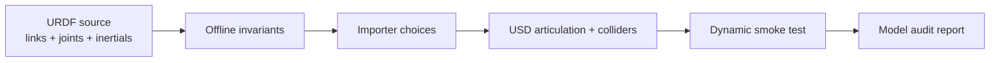
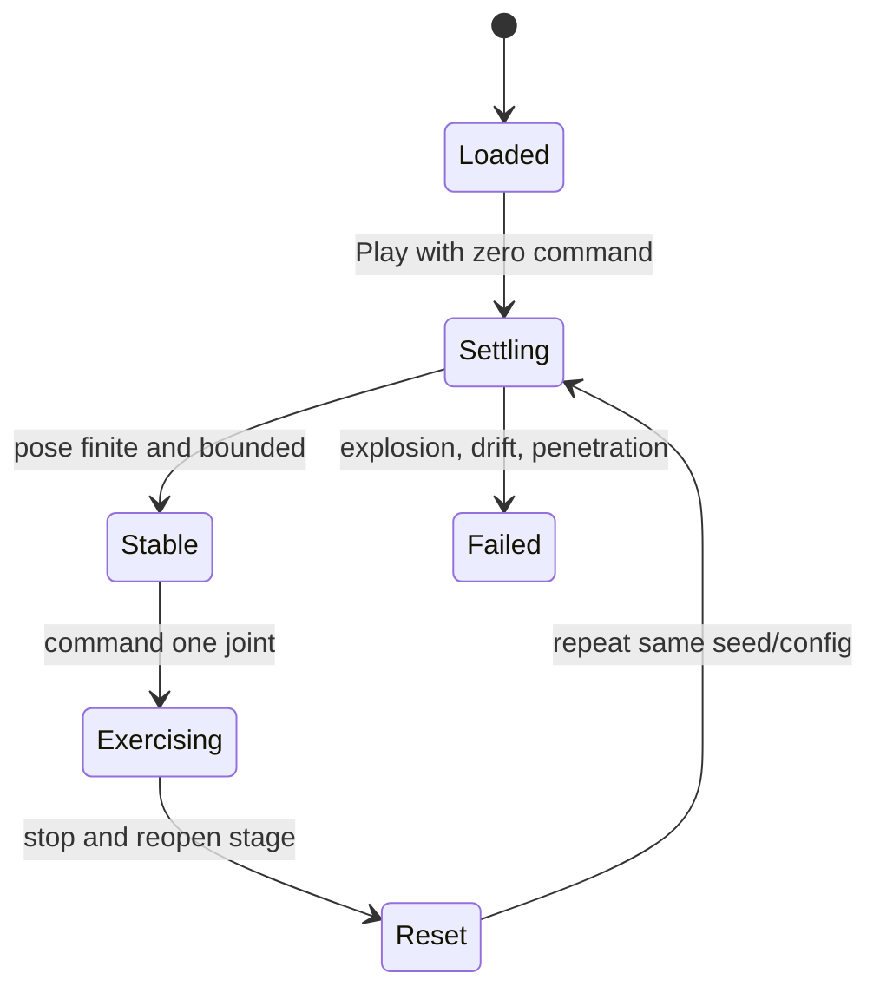
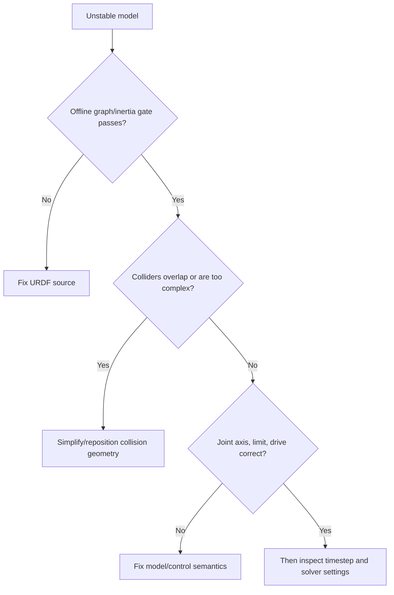

# Lab 06 — URDF-to-USD Robot Model Audit

- **Prerequisite:** Labs 01–05 pass and the evidence package identifies the simulator/workspace version.
- **Goal:** prove that a robot description is structurally valid before tuning its simulated behavior.
- **Pass:** the offline URDF gate passes, imported USD ownership is understood, colliders/inertias/joints are inspected, and a repeatable dynamic smoke test has no unexplained instability.

- Live page: <https://buicongnguyen.github.io/robotics-simulation-engineer/lab-06-urdf-model-audit.html>
- [NVIDIA URDF Import tutorial](https://docs.isaacsim.omniverse.nvidia.com/6.0.1/importer_exporter/import_urdf.html)
- [NVIDIA URDF Importer reference](https://docs.isaacsim.omniverse.nvidia.com/latest/importer_exporter/ext_isaacsim_asset_importer_urdf.html)
- [NVIDIA Physics Inspector](https://docs.isaacsim.omniverse.nvidia.com/6.0.1/physics/physics_inspector.html)
- Auditor: [lab-assets/urdf_audit.py](lab-assets/urdf_audit.py)

## Why model audit precedes tuning



Friction cannot repair a disconnected tree. Damping cannot repair a wrong joint axis. More solver iterations cannot repair a non-physical inertia matrix. Fix the earliest invalid contract.

## Definitions that must stay separate

| Term | Meaning | Typical failure |
|---|---|---|
| Visual geometry | what the renderer draws | pretty model hides bad physics |
| Collision geometry | shapes used for contact | mesh too complex, missing, intersecting, or oversized |
| Inertial frame | center of mass and inertia orientation | unexpected tipping or oscillation |
| Joint frame/axis | permitted relative motion | sign, axis, or origin error |
| Articulation root | solver ownership boundary | wrong root or disconnected links |
| Drive | control law applied at a joint | position/velocity/effort mismatch |

## Step 1 — run the offline gate

Use the supplied known-good fixture first. The auditor uses only the Python standard library, so any Python 3.10+ works, and reports go to this attempt's run folder, never into `fixtures/`:

```powershell
python "$Assets\urdf_audit.py" "$Assets\fixtures\valid_robot.urdf" --output "$Run\model_audit.json"
```

The auditor checks:

- exactly one root link and a connected acyclic link graph;
- one parent joint per child;
- valid parent/child references and unique names, and mimic targets that exist;
- finite positive mass;
- a physically realizable inertia tensor: positive principal moments that also satisfy the triangle inequality (each moment ≤ the sum of the other two, with 0.1% allowance for rounded published values). Positive-definite alone is not enough. For example, `diag(1, 1, 3)` is positive-definite but no rigid body has it;
- required limits for revolute/prismatic joints;
- positive effort/velocity limits and non-zero joint axes;
- declared collision and inertial blocks.

It also cross-checks each link's inertia against its collision shape. When a link has one box, cylinder, or sphere collider sharing the inertial frame, a moment that differs by more than 25% from a uniform solid of the same mass is reported as a review warning. That catches values typed onto the wrong axis.

Warnings are review items, not automatic proof of failure. For example, a deliberately massless frame may be fixed into a parent, but that decision must be recorded.

## Step 2 — perform a planted-fault test

Copy the fixture and change one invariant at a time:

1. Set a mass to zero.
2. Make a joint child reference an unknown link.
3. Make `ixx` negative.
4. Raise the base `izz` to `0.25`, so `ixx + iyy < izz`.
5. Remove one collision block.
6. Swap the wheel's `iyy` and `izz`, putting the axial moment on the wrong axis.

Faults 1–4 must fail. Faults 5 and 6 are reported as review warnings. Restore the original before continuing. A validator that never fails is not evidence. `tests/test_lab_tools.py` encodes each of these faults, so CI proves the auditor can still fail.

Fault 6 is not hypothetical. An earlier version of this fixture had the wheel's axial moment on `iyy` and a 4% error in the base `iyy`, and the earlier auditor passed it because it only checked positive-definiteness.

## Step 3 — record import choices before clicking Import

In Isaac Sim choose **File → Import**, select the URDF, and write an import manifest:

| Setting | Decision to record | Why it matters |
|---|---|---|
| USD output | project-owned path | avoids editing generated cache content |
| Fix base | true only for anchored robots | changes degrees of freedom |
| Self collision | justified on/off | affects contact count and stability |
| Collider type | simple/convex decomposition | accuracy/performance tradeoff |
| Drive type | force or acceleration | changes mass sensitivity |
| Joint target | none/position/velocity | must match controller semantics |
| Default density | fallback only | must not silently replace known masses |

Do not overwrite the source URDF. Treat imported USD as a generated layer and place project-specific overrides in a separate USD layer when practical.

## Step 4 — inspect the imported USD

In the Stage and Property panels verify:

1. The intended prim owns `ArticulationRootAPI`.
2. Each physical link has the expected rigid body and collider.
3. Collision shapes match the visual silhouette without unnecessary detail.
4. Joint axes and limits agree with the source model.
5. Wheel joints use velocity drives; torque-controlled joints do not inherit position drives.
6. Mass and center of mass are plausible in SI units.
7. No colliders begin interpenetrating at the nominal pose.

Turn on viewport collision visualization: **eye icon → Show by type → Physics → Colliders → All**. Use Physics Inspector for joint limits, drives, and articulation behavior.

## Step 5 — run a deterministic smoke sequence



Run at least three identical trials:

- 5 seconds at zero command;
- one low-amplitude joint or wheel command;
- explicit zero command;
- Stop, reopen the saved stage, and repeat.

Record initial/final pose, maximum joint speed, warnings, visible penetrations, and whether reset reproduces the result.

## Debugging decision tree



## Evidence and gate

Save the source hash, auditor JSON, import manifest, Stage screenshot with API ownership, collider screenshot, inertia/joint table, three smoke-test rows, and one planted-fault result.

**Gate:** proceed only when structure and physical metadata are explainable, the imported articulation behaves repeatably, and no tuning parameter is being used to conceal a model defect.

Next: [Lab 07 — Physics identification](lab-07-physics-identification.md).
