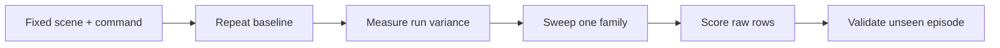
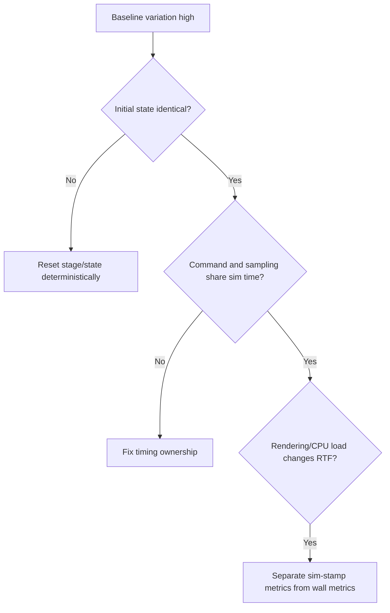

# Lab 07 — Physics Parameter Identification

- **Prerequisite:** Lab 06 model audit passes.
- **Goal:** estimate a defensible nominal parameter set from controlled simulation response data.
- **Pass:** repeatability is measured, one parameter family is swept at a time, a declared score selects a candidate, and the candidate improves held-out behavior.

- Live page: <https://buicongnguyen.github.io/robotics-simulation-engineer/lab-07-physics-identification.html>
- [NVIDIA Physics Simulation Fundamentals](https://docs.isaacsim.omniverse.nvidia.com/6.0.1/physics/simulation_fundamentals.html)
- [NVIDIA Robot Simulation Tips](https://docs.isaacsim.omniverse.nvidia.com/6.0.0/robot_simulation/robot_simulation_tips.html)
- Scorer: [lab-assets/score_parameter_sweep.py](lab-assets/score_parameter_sweep.py)

## Identification is not random tuning



Parameter identification asks which values explain specified observations. Random tuning asks which values look acceptable once. Only the first supports review and later uncertainty bounds.

## Step 1 — declare one experiment

Use the Lab 03 TurtleBot response or a Lab 06 joint step. Freeze:

- USD stage and source hash;
- initial pose and reset method;
- physics step, render rate, and real-time mode;
- command waveform and duration;
- sensor/topic sampling method;
- GPU/driver/simulator build;
- metrics and acceptance thresholds.

Example outputs:

```text
stop_distance_m
yaw_error_rad
settling_time_s
peak_wheel_speed_rad_s
```

## Step 2 — measure repeatability before changing parameters

Run the identical baseline at least five times. Compute mean, standard deviation, min, and max. If the between-run range is larger than the improvement you hope to measure, fix reset, timing, or observation first.



## Step 3 — choose identifiable parameter families

| Symptom/metric | First parameter family | Confounders to hold fixed |
|---|---|---|
| stopping distance | dynamic friction, drive damping | mass, command, timestep |
| yaw response | wheel radius/separation, friction asymmetry | controller mapping |
| settling/overshoot | drive stiffness/damping | payload, timestep |
| impact bounce | restitution/compliant contact | collision geometry |
| penetration/jitter | timestep/solver iterations | collider and inertia validity |

Contact behavior combines both contacting materials. Record static/dynamic friction, restitution, compliant-contact settings, and combine modes on both surfaces.

## Step 4 — produce raw sweep rows

Use the provided CSV schema:

```csv
scenario_id,friction,damping,mass_scale,stop_distance,yaw_error,settling_time
```

Change one parameter family per sweep. Use at least three repetitions per candidate and retain every raw row; do not keep only the best-looking run.

## Step 5 — rank using a declared contract

```powershell
$Assets = "C:\Users\n\source\repos\issac_sim\robotics-simulation-engineer\lab-assets"
C:\isaacsim-6.0.1\python.bat "$Assets\score_parameter_sweep.py" `
  "$Assets\fixtures\physics_sweep.csv" `
  "$Assets\fixtures\physics_targets.json" `
  --output "$Assets\fixtures\physics_fit_report.json"
```

The score is a weighted sum of absolute normalized errors:

```text
score = Σ weight_i × |observed_i - target_i| / scale_i
```

Targets, normalization scales, and weights must be written before looking at results. Otherwise the scoring rule can be manipulated to select a preferred answer.

## Step 6 — challenge the candidate on a held-out episode

Do not validate with the same command used for calibration. Examples:

- calibrate on forward stop; validate on turning stop;
- calibrate with nominal payload; validate with a declared payload change;
- calibrate at one speed; validate at a second safe speed.

Compare the selected candidate with the original baseline. Improvement must exceed repeat variability on the held-out metric. If several parameter sets fit equally well, report non-identifiability rather than inventing precision.

## Evidence and gate

Save experiment contract, baseline repetitions, raw sweep CSV, scoring JSON, parameter provenance, held-out rows, and an explanation of remaining ambiguity.

**Gate:** proceed only when a nominal configuration improves held-out error beyond repeat variability without breaking Labs 01–06 contracts.

Next: [Lab 08 — Regression and CI](lab-08-regression-ci.md).
