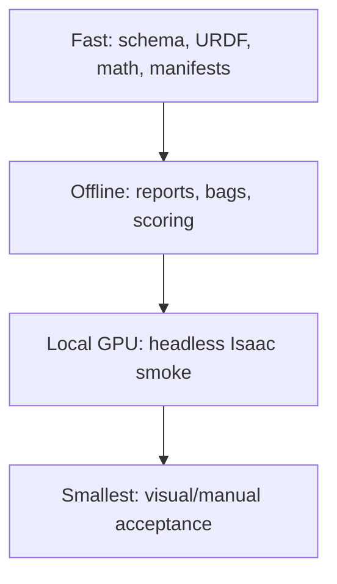
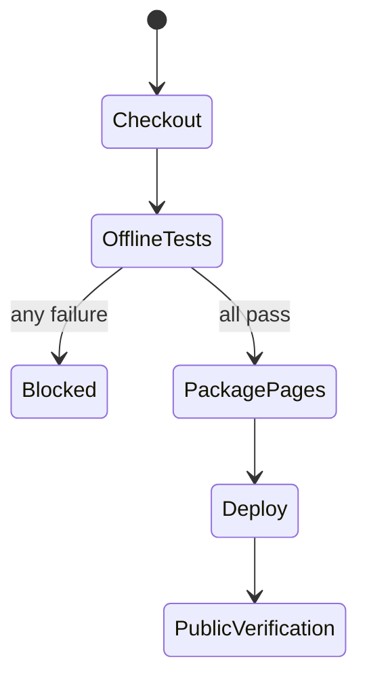

# Lab 08 — Automated Regression and CI

- **Prerequisite:** Lab 07 has a versioned nominal model and raw evidence.
- **Goal:** turn the lab gates into deterministic automated failures before publishing or running an expensive GPU simulation.
- **Pass:** offline tests pass, a planted defect fails, evidence aggregation blocks incomplete runs, and GitHub Pages deploys only after tests.

- Live page: <https://buicongnguyen.github.io/robotics-simulation-engineer/lab-08-regression-ci.html>
- [NVIDIA Python/SimulationApp workflow](https://docs.isaacsim.omniverse.nvidia.com/6.0.1/installation/install_python.html)
- [NVIDIA workflow guidance](https://docs.isaacsim.omniverse.nvidia.com/6.0.1/introduction/workflows.html)
- Test suite: [lab-assets/tests/test_lab_tools.py](lab-assets/tests/test_lab_tools.py)
- Evidence gate: [lab-assets/evidence_gate.py](lab-assets/evidence_gate.py)

## Use a test pyramid, not one giant simulator test



GitHub-hosted runners do not provide this workstation’s RTX simulator environment. CI must say what ran. Offline contracts run on GitHub; GPU Isaac tests run locally or on a deliberately configured self-hosted runner.

## Step 1 — run the repository’s offline tests

Use the session variables from [Shared startup](ros2-labs.md#shared-startup). The offline suite needs only the Python standard library:

```powershell
python -m unittest discover -s "$Assets\tests" -v
```

It covers four areas:
- **Every contract:** clock, JointState, TF tree, watchdog latency, image payload, and CameraInfo.
- **Every URDF planted fault from Lab 06.**
- **Sweep, benchmark, and robustness statistics:** candidate means and identifiability, the held-out rule, the exact Mann–Whitney p-value, workload identity, the Latin-hypercube strata, the Wilson interval, and failure bins.
- **Two end-to-end command runs** that execute the documented Lab 06–10 commands on the shipped fixtures, feed their reports to the evidence gate, and check that failing inputs exit non-zero.

The local ROS lane runs the tools against real ROS: it writes MCAP bags through `bag_contract_check.py` and runs the watchdog node, including `Ctrl+C`.

```powershell
pwsh -NoProfile -ExecutionPolicy Bypass -File $Launcher python -m unittest discover -s "$Assets\tests\ros" -v
```

## Step 2 — prove negative tests

Each planted fault below is already a test, so CI proves the validators can still fail. Find each one, then plant one yourself in a copied fixture (never the canonical file) and watch the matching test's target fail:

| Planted fault | Test |
|---|---|
| zero mass, unknown link, negative `ixx`, triangle violation, zero axis | `UrdfAuditTests.test_planted_faults` |
| repeated or truncated image payload, short stride, empty encoding | `ContractTests.test_image_planted_faults` |
| missing, malformed, non-object, `ok:false`, or `ok:"true"` evidence | `EvidenceGateTests.test_missing_false_malformed_and_non_object_reports_fail` |
| zero wall duration | `BenchmarkTests.test_zero_wall_duration_is_rejected` |
| confounded sweep, single runs | `ParameterSweepTests.test_confounded_sweep_is_rejected`, `test_single_runs_are_rejected` |
| NaN watchdog timeout | `ContractTests.test_watchdog_rejects_timeouts_that_would_fail_open` |

Each must fail for the correct reason. Restore the fixture and rerun green.

## Step 3 — aggregate a run contract

Each earlier lab writes its report into `$Run`, so the gate names exactly those files:

```powershell
python "$Assets\evidence_gate.py" `
  --require camera="$Run\camera_probe.json" `
  --require bag="$Run\bag_contract.json" `
  --require model="$Run\model_audit.json" `
  --require physics="$Run\physics_fit.json" `
  --output "$Run\gate.json"
```

After Labs 09 and 10, add `--require performance="$Run\performance.json"` and `--require robustness="$Run\robustness.json"`.

The aggregator accepts only a JSON object whose top-level `ok` is exactly `true`. A missing, malformed, non-object, or explicitly failed report, or a duplicated requirement name, makes the combined gate fail.

It reads UTF-8, and also UTF-16 with a byte-order mark. Windows PowerShell 5.1's `>` redirection writes UTF-16, so a hand-redirected report still parses. Prefer each tool's `--output` anyway.

## Step 4 — understand the CI state machine



The Pages workflow runs `python scripts/check_all.py` before uploading the site artifact. That runs:
- the lab-tool tests;
- every exercise in both directions (the reference must pass, and the planted defect or starter must fail);
- internal link and anchor checks;
- a check that the generated lab pages match their Markdown.

It does not claim to launch Isaac Sim.

## Step 5 — define the optional local GPU lane

A local headless script must create `SimulationApp({"headless": True})` before importing Omniverse/Isaac modules, load a frozen stage, step a bounded number of frames, write JSON, close the app, and return a nonzero exit code on contract failure.

Do not add an unconfigured `self-hosted` job to the repository. First document runner ownership, GPU driver, timeout, cleanup, concurrency, cache, and secrets policy.

## Debugging order

```text
syntax/import → fixture → pure invariant → evidence file → local GPU smoke → GUI
```

Escalating directly to the GUI makes failures harder to reproduce and slower to isolate.

## Evidence and gate

Save local test output, planted-fault output, aggregated gate JSON, workflow run URL/SHA, and a matrix stating which checks are offline, local GPU, or manual.

**Gate:** a clean commit passes; a planted defect blocks; the public deployment cannot bypass the offline robotics tests.

Next: [Lab 09 — Performance engineering](lab-09-performance-profiling.md).
