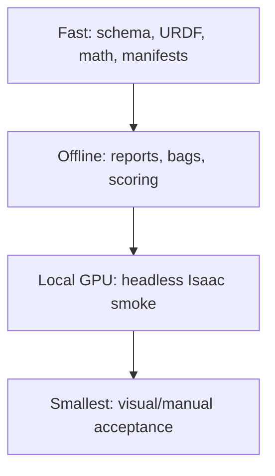
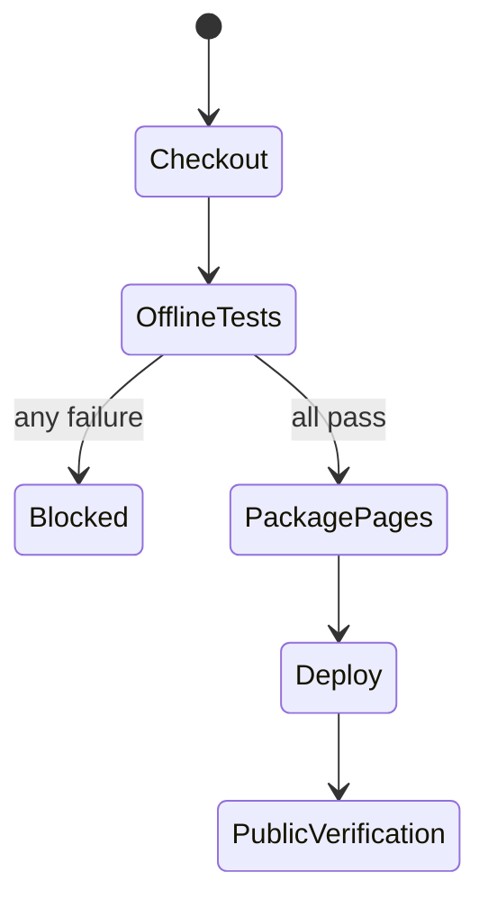

# Lab 08 — Automated Regression and CI

- **Prerequisite:** Lab 07 has a versioned nominal model and raw evidence.
- **Goal:** turn the lab gates into deterministic automated failures before publishing or running an expensive GPU simulation.
- **Pass:** offline tests pass, a planted defect fails, evidence aggregation blocks incomplete runs, and GitHub Pages deploys only after tests.

- Live page: <https://buicongnguyen.github.io/robotics-simulation-engineer/lab-08-regression-ci.html>
- [NVIDIA Python/SimulationApp workflow](https://docs.isaacsim.omniverse.nvidia.com/6.0.1/installation/install_python.html)
- [NVIDIA workflow guidance](https://docs.isaacsim.omniverse.nvidia.com/6.0.1/introduction/workflows.html)
- Test suite: [lab-assets/tests/test_lab_tools.py](lab-assets/tests/test_lab_tools.py)
- Evidence gate: [lab-assets/evidence_gate.py](lab-assets/evidence_gate.py)

## Use a test pyramid, not one giant simulator test



GitHub-hosted runners do not provide this workstation’s RTX simulator environment. CI must say what ran. Offline contracts run on GitHub; GPU Isaac tests run locally or on a deliberately configured self-hosted runner.

## Step 1 — run the repository’s offline tests

```powershell
C:\isaacsim-6.0.1\python.bat -m unittest discover `
  -s C:\Users\n\source\repos\issac_sim\robotics-simulation-engineer\lab-assets\tests -v
```

The suite checks camera-message sequences, watchdog timeouts, URDF failures, sweep ranking, benchmark math, robustness coverage, and evidence aggregation.

## Step 2 — prove negative tests

Temporarily change a copied fixture, never the canonical file:

- zero mass in a copied URDF;
- repeated image timestamp;
- missing evidence JSON;
- `ok:false` report;
- benchmark with zero wall duration.

Each must fail for the correct reason. Restore the fixture and rerun green.

## Step 3 — aggregate a run contract

```powershell
$Assets = "C:\Users\n\source\repos\issac_sim\robotics-simulation-engineer\lab-assets"
C:\isaacsim-6.0.1\python.bat "$Assets\evidence_gate.py" `
  --require model="$Run\model_audit.json" `
  --require physics="$Run\physics_fit_report.json" `
  --require camera="$Run\camera_probe.json" `
  --output "$Run\gate.json"
```

The aggregator accepts only valid JSON with top-level `ok:true`. A missing, malformed, or explicitly failed report makes the combined gate fail.

## Step 4 — understand the CI state machine



The Pages workflow now executes the standard-library robotics tests before uploading the site artifact. It does not claim to launch Isaac Sim.

## Step 5 — define the optional local GPU lane

A local headless script must create `SimulationApp({"headless": True})` before importing Omniverse/Isaac modules, load a frozen stage, step a bounded number of frames, write JSON, close the app, and return a nonzero exit code on contract failure.

Do not add an unconfigured `self-hosted` job to the repository. First document runner ownership, GPU driver, timeout, cleanup, concurrency, cache, and secrets policy.

## Debugging order

```text
syntax/import → fixture → pure invariant → evidence file → local GPU smoke → GUI
```

Escalating directly to the GUI makes failures harder to reproduce and slower to isolate.

## Evidence and gate

Save local test output, planted-fault output, aggregated gate JSON, workflow run URL/SHA, and a matrix stating which checks are offline, local GPU, or manual.

**Gate:** a clean commit passes; a planted defect blocks; the public deployment cannot bypass the offline robotics tests.

Next: [Lab 09 — Performance engineering](lab-09-performance-profiling.md).
