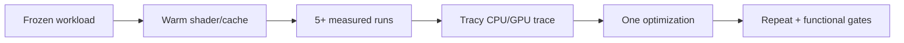
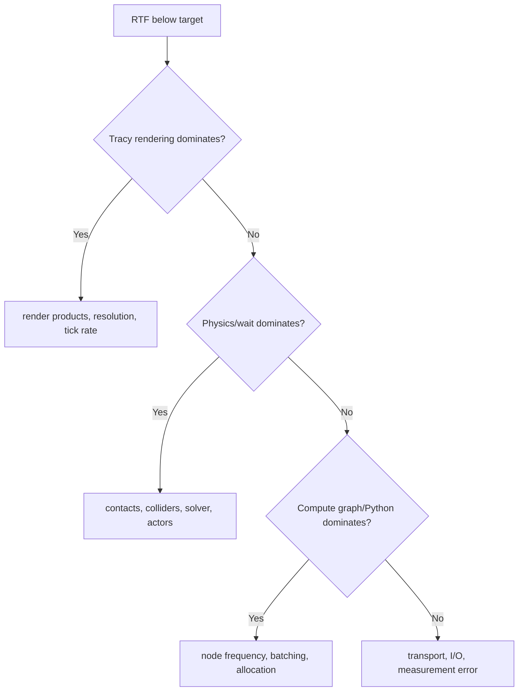

# Lab 09 — Performance Profiling and Scaling

- **Prerequisite:** Lab 08 regression gates are green.
- **Goal:** locate a measured bottleneck, change one variable, and demonstrate improvement without sacrificing correctness.
- **Pass:** repeated baselines, a Tracy trace, a bottleneck hypothesis, controlled before/after rows, and unchanged functional gates.

- Live page: <https://buicongnguyen.github.io/robotics-simulation-engineer/lab-09-performance-profiling.html>
- [NVIDIA Tracy profiling guide](https://docs.isaacsim.omniverse.nvidia.com/6.0.1/utilities/debugging/profiling_performance.html)
- [NVIDIA Performance Optimization Handbook](https://docs.isaacsim.omniverse.nvidia.com/6.0.1/reference_material/sim_performance_optimization_handbook.html)
- Analyzer: [lab-assets/benchmark_summary.py](lab-assets/benchmark_summary.py)

## Define the metrics before optimizing

| Metric | Formula/meaning | Do not confuse with |
|---|---|---|
| simulation FPS | simulated steps per wall second | render FPS |
| render FPS | rendered frames per wall second | physics rate |
| RTF | simulated seconds / wall seconds | configured timestep |
| topic rate | messages received per wall second | sensor timestamp cadence |
| latency | command/event to observed result | throughput |
| VRAM peak | maximum allocated GPU memory | GPU utilization |



## Step 1 — freeze a benchmark contract

Record stage hash, sensor resolutions/rates, number of robots, physics timestep, rendering mode, ROS publishers, headless/GUI mode, warm-up duration, measured duration, and power/background-process conditions.

Warm up shaders and assets before timing. Separate startup time from steady-state throughput.

## Step 2 — collect repeated rows

Use this schema:

```csv
run,sim_seconds,wall_seconds,frames,gpu_memory_mb,notes
```

Capture at least five baseline rows. Then summarize:

```powershell
$Assets = "C:\Users\n\source\repos\issac_sim\robotics-simulation-engineer\lab-assets"
C:\isaacsim-6.0.1\python.bat "$Assets\benchmark_summary.py" `
  "$Assets\fixtures\benchmark_runs.csv" `
  --output "$Assets\fixtures\benchmark_baseline.json"
```

The report includes median, 5th/95th percentiles, and RTF coefficient of variation. High variation means the benchmark is not stable enough for a small optimization claim.

## Step 3 — use Tracy to identify ownership

Enable `omni.kit.profiler.tracy`, launch/connect the bundled Tracy UI, collect a short steady-state trace, then stop capture. Inspect:

- **Timeline Update / physics:** collision count, solver work, articulation stepping;
- **Compute Graphs:** OmniGraph and Python-node execution;
- **Rendering:** render products, RTX sensors, resolution;
- **thread waiting:** the worker/GPU task that owns the critical wait.

Profiling adds overhead. Use it to identify the bottleneck, then disable it for final timing.

## Step 4 — choose one controlled optimization

| Bottleneck | Candidate change | Required invariant |
|---|---|---|
| rendering | reduce one render-product resolution | camera schema/frame still valid |
| RTX sensor | lower justified `omni:sensor:tickRate` | required temporal coverage retained |
| physics | simplify colliders | contact outcome remains within tolerance |
| excessive USD writes | evaluate Fabric/headless workflow | saved-state/evidence semantics declared |
| ROS bandwidth | disable unused publisher or compress deliberately | consumer contract updated |
| Python | batch work/remove per-frame allocation | outputs numerically equivalent |

Never change resolution, tick rate, collider complexity, and environment count together.

## Step 5 — compare against a stored baseline

```powershell
C:\isaacsim-6.0.1\python.bat "$Assets\benchmark_summary.py" `
  "$Run\optimized.csv" `
  --baseline "$Assets\fixtures\benchmark_baseline.json" `
  --max-rtf-regression 0.05 `
  --output "$Run\optimized_report.json"
```

For an intended speedup, explain why the new median improved and why p05/p95 and correctness remained acceptable. For scaling, test environment or robot counts geometrically (1, 2, 4, 8…) until RTF, VRAM, or latency violates the declared gate.

## Bottleneck decision logic



## Evidence and gate

Save contract, warm-up rule, raw CSVs, summary JSONs, Tracy trace/screenshot, bottleneck hypothesis, exact change, and rerun of Labs 01–08 gates.

**Gate:** one measured bottleneck is improved beyond run variability, with no hidden workload reduction and no failed functional contract.

Next: [Lab 10 — Robustness and transfer reasoning](lab-10-domain-randomization.md).
