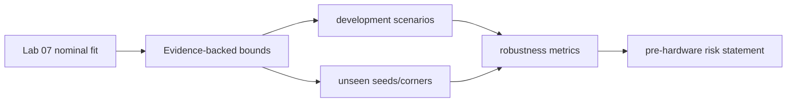
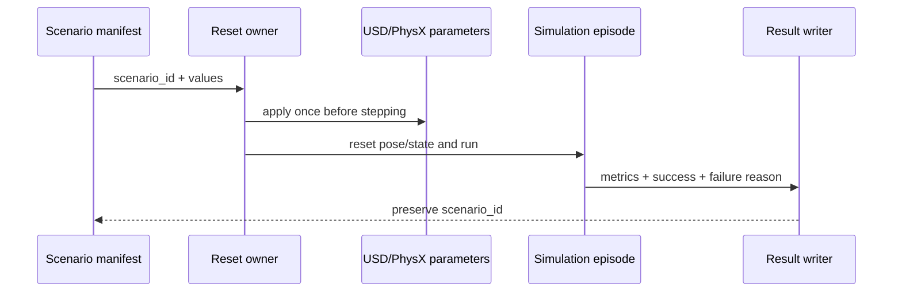
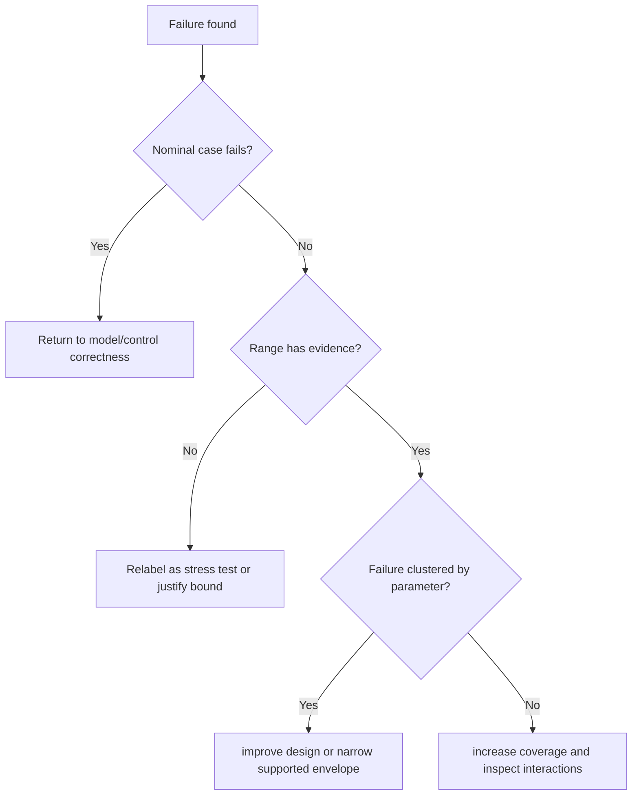

# Lab 10 — Domain Randomization and Sim-to-Real Reasoning Without Hardware

- **Prerequisite:** Lab 09 establishes a correct, calibrated, and measurable nominal pipeline.
- **Goal:** test sensitivity to justified uncertainty and produce an honest pre-hardware robustness claim.
- **Pass:** every range has provenance, scenarios are seeded and cover the space, results are complete, held-out cases are evaluated, and claims stop at simulation evidence.

- Live page: <https://buicongnguyen.github.io/robotics-simulation-engineer/lab-10-domain-randomization.html>
- [NVIDIA Replicator randomization snippets](https://docs.isaacsim.omniverse.nvidia.com/6.0.1/replicator_tutorials/tutorial_replicator_isaac_randomizers.html)
- [NVIDIA current domain-randomization API notice](https://docs.isaacsim.omniverse.nvidia.com/6.0.0/py/source/deprecated/isaacsim.replicator.domain_randomization/docs/index.html)
- Scenario tool: [lab-assets/robustness_scenarios.py](lab-assets/robustness_scenarios.py)

## Calibration, uncertainty, and stress testing are different



| Range source | Meaning |
|---|---|
| measured repeatability | observation/process uncertainty |
| component tolerance/datasheet | manufacturing uncertainty |
| literature or vendor model | documented prior |
| calibrated confidence region | identification uncertainty |
| deliberate stress range | failure discovery, not realism claim |

Never use randomization to hide an incorrect nominal model.

## Step 1 — write the uncertainty contract

Start with the supplied example and replace each bound with justified values:

```json
{
  "dynamic_friction": [0.55, 0.85],
  "joint_damping_scale": [0.8, 1.2],
  "mass_scale": [0.9, 1.1],
  "sensor_latency_ms": [0.0, 40.0]
}
```

For each field record units, nominal value, lower/upper source, application location, and whether it is calibration uncertainty or stress testing.

## Step 2 — generate deterministic stratified scenarios

```powershell
$Assets = "C:\Users\n\source\repos\issac_sim\robotics-simulation-engineer\lab-assets"
C:\isaacsim-6.0.1\python.bat "$Assets\robustness_scenarios.py" generate `
  "$Assets\fixtures\robustness_bounds.json" `
  --count 32 --seed 20260803 --output "$Run\scenarios.json"
```

The generator uses one shuffled sample from every stratum of every dimension. This provides better marginal coverage than unrelated uniform draws at the same count. The seed, bounds, and exact samples are saved.

## Step 3 — apply one scenario at episode reset

Use USD/PhysX APIs or Replicator to apply the manifest values before the episode begins. Keep one ownership point:



The older `isaacsim.replicator.domain_randomization` extension is deprecated in Isaac Sim 6.0 in favor of `isaacsim.replicator.experimental.domain_randomization`. Check the installed API before copying older Isaac Gym examples.

## Step 4 — define success before running

Example task contract:

```text
reach goal without collision
final position error <= 0.15 m
final yaw error <= 0.10 rad
watchdog violations == 0
all timestamps/frames/contracts pass
```

Write one results row per scenario:

```csv
scenario_id,success,position_error,yaw_error,stop_distance,failure_reason
```

Missing rows are failures of experimental completeness, not silently excluded data.

## Step 5 — evaluate completeness and pass rate

```powershell
C:\isaacsim-6.0.1\python.bat "$Assets\robustness_scenarios.py" evaluate `
  "$Run\scenarios.json" "$Run\results.csv" `
  --minimum-pass-rate 0.90 --output "$Run\robustness_report.json"
```

Report pass rate, missing/extra IDs, worst scenarios, failure clusters, and sensitivity plots. Overall pass rate alone can hide a complete failure at one physically important corner.

## Step 6 — use held-out scenarios

Freeze all design decisions, then evaluate:

- new seeds inside the same justified bounds;
- selected corners and coupled adverse cases;
- one stress band just outside the claimed operating range.

Do not adjust the controller after seeing held-out results and still call them held out.

## Decision logic



## What you may claim without a robot

You may claim seeded simulation robustness, sensitivity analysis, reproducible uncertainty coverage, identified failure envelopes, and pre-hardware test readiness. You may not claim physical transfer success, calibrated real-world friction/noise, hardware safety, or deployment reliability.

## Evidence and final gate

Save range-provenance table, bounds JSON, scenario manifest, exact simulator/config hashes, every result row, robustness report, held-out report, worst-case reproductions, and the bounded claim paragraph.

**Gate:** another engineer can regenerate the exact scenarios, reproduce completeness/pass-rate calculations, inspect failures, and understand precisely what remains unverified without hardware.

Return to the [ten-lab map](ros2-labs.md) and assemble the portfolio evidence packet.
