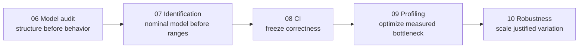

# Labs 06–10 implementation plan and logic review

This plan extends the ROS pipeline into the remaining skills expected of a robotics simulation engineer while staying executable on the installed native-Windows Isaac Sim 6.0.1 workstation.

| Lab | Question | Executable artifact | Gate |
|---|---|---|---|
| 06 · Robot model audit | Is the imported robot structurally and physically credible? | URDF auditor + USD inspection report | one root, connected graph, valid limits/mass/inertia/colliders |
| 07 · Physics identification | Which parameters explain a controlled response? | sweep CSV + ranked fit report | repeatability measured; held-out error beats baseline |
| 08 · Regression and CI | Can contracts fail automatically before deployment? | pure-Python tests + evidence aggregator + Pages CI | planted fault fails; clean fixtures pass |
| 09 · Performance engineering | Where is time spent and did optimization help? | Tracy trace + benchmark CSV summary | controlled change improves declared metric without contract failure |
| 10 · Robustness and transfer reasoning | Does the pipeline survive justified uncertainty? | seeded scenario manifest + robustness report | coverage, pass rate, worst cases, and claim boundary recorded |

## Dependency logic review

1. **Correctness precedes calibration.** A parameter sweep cannot repair a disconnected joint graph, invalid inertia, or collider mistake.
2. **Calibration precedes randomization.** Randomization bounds must come from measurement, literature, tolerance, or an explicit stress-test hypothesis—not arbitrary wide ranges.
3. **Regression precedes optimization.** A faster simulator that silently changes frames, timestamps, contacts, or outcomes has regressed.
4. **Profiling precedes scaling.** Environment count, rendering, physics, Python, and ROS transport stress different resources; change only the measured bottleneck.
5. **Simulation robustness is not physical sim-to-real proof.** Without hardware, Lab 10 demonstrates sensitivity analysis, uncertainty discipline, and pre-hardware risk reduction.

## Platform feasibility review

- Native Windows Isaac Sim 6.0.1 remains the simulator runtime.
- ROS exercises continue through the installed Jazzy/Pixi/Zenoh launcher.
- Offline auditors, scorers, and CI tests use Python standard-library code and run without a GPU.
- GUI/standalone simulator experiments use the bundled `C:\isaacsim-6.0.1\python.bat` when Isaac APIs are needed.
- GPU Isaac Sim tests are documented as local or optional self-hosted-runner jobs; GitHub-hosted Pages CI does not pretend to provide RTX hardware.
- Isaac Lab is optional future work, not a prerequisite for completing these labs.

## Evidence rule

Every lab must preserve inputs, versions, seeds, commands, raw rows, derived metrics, thresholds, and the first failing boundary. Screenshots are supporting evidence, never the only evidence.
