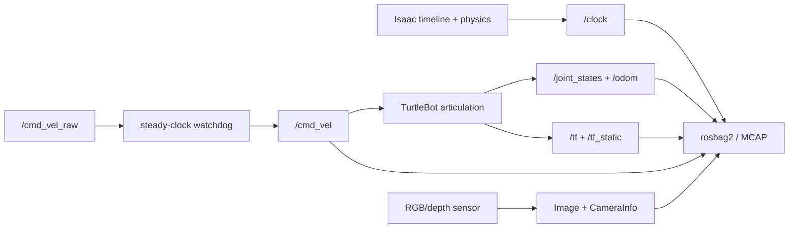

# Isaac Sim + ROS 2 Practical Labs 01–05

Follow these labs in order on this workstation. They use one native-Windows contract:

```yaml
simulator: C:\isaacsim-6.0.1
ros: Jazzy
workspace: C:\IsaacSim-ros_workspaces\jazzy_ws
middleware: rmw_zenoh_cpp
domain: 0
launcher: robotics-simulation-engineer\Start-IsaacRosJazzy.ps1
wsl: not used
```

## Official NVIDIA configuration route

Use the version-pinned page while reproducing these Isaac Sim 6.0.1 labs. Use the latest page only to check what NVIDIA changed after this course was written.

- [NVIDIA Isaac Sim 6.0.1 — ROS 2 Installation (Other Platforms)](https://docs.isaacsim.omniverse.nvidia.com/6.0.1/installation/install_ros_other_platforms.html): the authoritative Windows 11 + Jazzy + Pixi workflow, workspace build, launch order, and Zenoh configuration.
- [NVIDIA current ROS 2 Installation (Other Platforms)](https://docs.isaacsim.omniverse.nvidia.com/latest/installation/install_ros_other_platforms.html): compare current support before upgrading Isaac Sim or the workspace.
- [NVIDIA Isaac Sim ROS Workspaces](https://github.com/isaac-sim/IsaacSim-ros_workspaces): the upstream Pixi workspace, ROS packages, launch tasks, and custom interfaces used by these labs.
- [NVIDIA Isaac Sim 6.0.1 ROS 2 tutorial index](https://docs.isaacsim.omniverse.nvidia.com/6.0.1/ros2_tutorials/ros2_landing_page.html): the official route to Clock, TF, TurtleBot, camera, and other ROS 2 exercises.

The pinned NVIDIA setup states that native Windows Pixi supports ROS 2 Jazzy, all Isaac Sim ROS 2 tutorials, and preconfigures `rmw_zenoh_cpp`. That is why this course uses the Windows launcher instead of WSL.

## Learning path

| Lab | Build | Primary proof | Page |
|---|---|---|---|
| 01 | Simulation clock | `/clock` increases only during Play | [Clock](isaac-sim-gui-clock-test.md) |
| 02 | Robot state | joint names/arrays agree and TF is a connected tree | [Joint states + TF](lab-02-joint-states-tf.md) |
| 03 | Motion command + watchdog | robot moves from fresh Twist and stops after timeout | [Command + watchdog](lab-03-cmd-vel-watchdog.md) |
| 04 | RGB/depth perception | valid image schema, frame, timestamp, rate, and payload | [Camera + depth](lab-04-camera-depth.md) |
| 05 | Record/replay validation | bag reproduces message contracts without Isaac publishers | [Rosbag validation](lab-05-rosbag-validation.md) |

## The system you will build



## Progress rule

Do not continue because a topic merely exists. Continue only after the current lab’s gate passes and its evidence is saved. If a later lab fails, return to the earliest violated contract:

```text
environment → discovery → simulator lifecycle → graph → schema → frame/time → rate → behavior
```

## Shared three-terminal startup

```powershell
$Launcher = "C:\Users\n\source\repos\issac_sim\robotics-simulation-engineer\Start-IsaacRosJazzy.ps1"
```

1. Terminal 1: `pwsh -NoProfile -ExecutionPolicy Bypass -File $Launcher zenoh`
2. Terminal 2: `pwsh -NoProfile -ExecutionPolicy Bypass -File $Launcher sim`
3. Terminal 3: use `... -File $Launcher ros2 ...` for CLI commands.

Run `... -File $Launcher verify` before each lab session. Keep WSL closed.

## Reference scenario

Labs 02–05 use NVIDIA's shipped TurtleBot scenario when available:

```text
Isaac Sim Content Browser
→ Isaac Sim
→ Samples
→ ROS2
→ Scenario
→ turtlebot_tutorial.usd
```

This is the fast-track baseline. Inspect its Action Graphs instead of treating the sample as magic. The labs explain each boundary and ask you to measure it.

## Completion artifact

When all five gates pass, create one portfolio folder containing:

- saved USD stages;
- graph screenshots;
- version and environment manifest;
- topic/type/QoS contract;
- TF tree and joint-state checks;
- watchdog log and stop-time result;
- camera probe JSON and rate/bandwidth results;
- rosbag metadata and replay validation;
- a short failure-and-fix note from each lab.

This is simulation-only evidence. It demonstrates simulator/ROS integration and validation discipline without claiming physical sim-to-real results.
