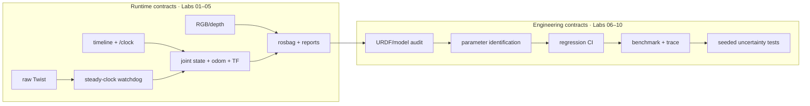
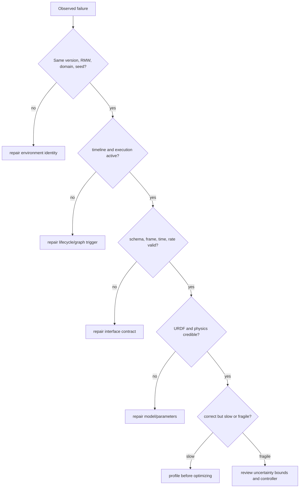

# Isaac Sim + ROS 2 Practical Labs 01–10

This fast track turns one native-Windows Isaac Sim pipeline into a reviewable simulation-engineering portfolio. Use the labs in order; each gate removes a class of ambiguity before the next lab adds complexity.

```yaml
simulator: C:\isaacsim-6.0.1
ros: Jazzy
workspace: C:\IsaacSim-ros_workspaces\jazzy_ws
middleware: rmw_zenoh_cpp
domain: 0
gpu: RTX 4080 SUPER
launcher: robotics-simulation-engineer\Start-IsaacRosJazzy.ps1
wsl: not used for this path
```

## Official baseline

- [Isaac Sim 6.0.1 ROS 2 installation on Windows](https://docs.isaacsim.omniverse.nvidia.com/6.0.1/installation/install_ros_other_platforms.html)
- [Isaac Sim 6.0.1 ROS 2 tutorials](https://docs.isaacsim.omniverse.nvidia.com/6.0.1/ros2_tutorials/ros2_landing_page.html)
- [NVIDIA Isaac Sim ROS workspaces](https://github.com/isaac-sim/IsaacSim-ros_workspaces)
- [Current Isaac Sim release downloads](https://docs.isaacsim.omniverse.nvidia.com/latest/installation/download.html)

Use the pinned pages to reproduce this course and the current page only to review upgrade changes.

## Ten-lab dependency path

| Lab | Question answered | Gate |
|---|---|---|
| [01 Clock](isaac-sim-gui-clock-test.md) | When does the simulation execute? | `/clock` has the right type, owner, and lifecycle |
| [02 State + TF](lab-02-joint-states-tf.md) | What moved, and in which frame? | joint arrays, odometry, and dynamic TF are consistent |
| [03 Control](lab-03-cmd-vel-watchdog.md) | How does a request become bounded motion? | command chain works and stale input reaches zero |
| [04 Camera](lab-04-camera-depth.md) | What was observed? | multi-sample image schema, frame, stamps, and cadence pass |
| [05 Replay](lab-05-rosbag-validation.md) | Can interface analysis be repeated? | metadata and offline validators reproduce conclusions |
| [06 Model audit](lab-06-urdf-model-audit.md) | Is the robot model structurally credible? | URDF graph, joints, mass, inertia, and collision audit pass |
| [07 Physics ID](lab-07-physics-identification.md) | Which parameters explain nominal behavior? | declared sweep and held-out validation select a model |
| [08 Regression CI](lab-08-regression-ci.md) | Will a change break a known contract? | deterministic unit and evidence gates run in CI |
| [09 Profiling](lab-09-performance-profiling.md) | Where is the actual bottleneck? | repeated benchmark plus trace supports one optimization |
| [10 Robustness](lab-10-domain-randomization.md) | Does performance survive plausible uncertainty? | seeded held-out scenarios meet the declared pass-rate gate |

The design and logic review for Labs 06–10 is recorded in [Labs 06–10 plan and dependency review](labs-06-10-plan.md).

## Big-picture architecture



## Debugging rule

When a test fails, move left until the first invariant fails:



## Shared startup

```powershell
$Launcher = "C:\Users\n\source\repos\issac_sim\robotics-simulation-engineer\Start-IsaacRosJazzy.ps1"
pwsh -NoProfile -ExecutionPolicy Bypass -File $Launcher verify
# Terminal 1
pwsh -NoProfile -ExecutionPolicy Bypass -File $Launcher zenoh
# Terminal 2
pwsh -NoProfile -ExecutionPolicy Bypass -File $Launcher sim
# Terminal 3+
pwsh -NoProfile -ExecutionPolicy Bypass -File $Launcher ros2 topic list -t
```

Keep WSL closed while using this native-Windows contract. Labs 02–05 can use NVIDIA's shipped `Samples → ROS2 → Scenario → turtlebot_tutorial.usd`; inspect its graph rather than treating it as a black box.

## Completion evidence

Save the version manifest, USD/URDF, graph screenshots, contract reports, bag metadata, parameter-sweep score, CI output, benchmark/trace, robustness matrix, and one failure→isolation→fix note per lab. This is strong simulation-engineering evidence. Without a physical robot, describe Lab 10 as simulation robustness and sim-to-real preparation—not measured sim-to-real transfer.
