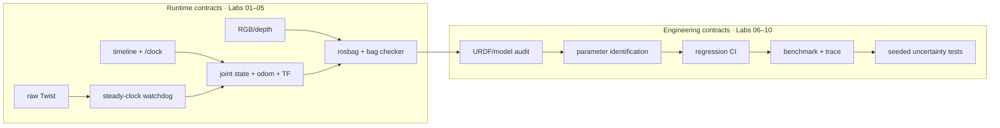
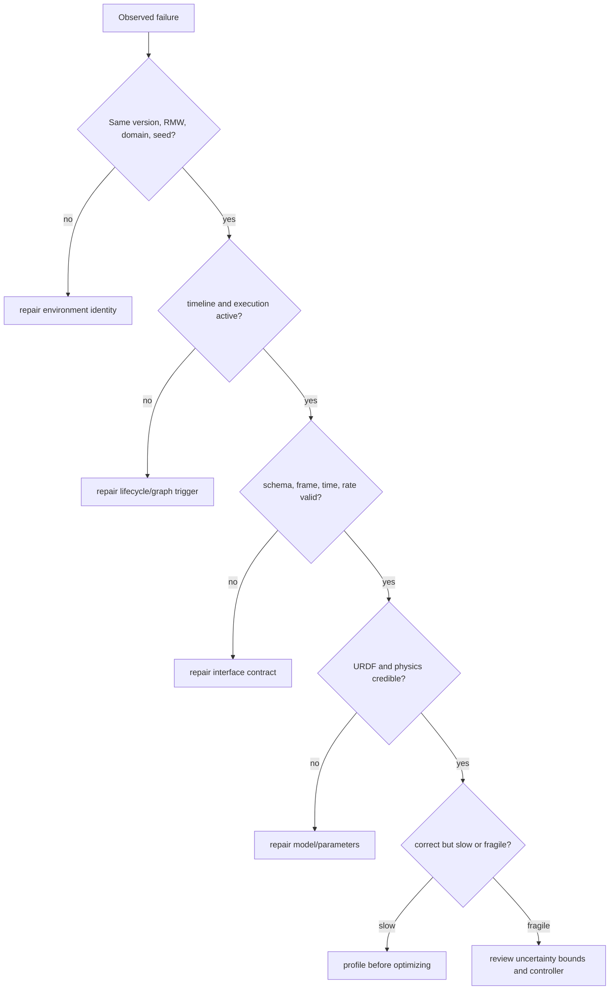

# Isaac Sim + ROS 2 Practical Labs 01–10

This fast track turns one native-Windows Isaac Sim pipeline into a reviewable simulation-engineering portfolio. Use the labs in order: each gate removes one class of ambiguity before the next lab adds complexity.

```yaml
simulator: Isaac Sim 6.0.1 — the pip package inside the Pixi workspace (the launcher's verify step prints its path)
standalone_install: C:\isaacsim-6.0.1 (used only as isaac_sim_package_path for runtime DLLs)
ros: Jazzy
workspace: C:\IsaacSim-ros_workspaces\jazzy_ws (override with ISAAC_ROS_WS)
middleware: rmw_zenoh_cpp
domain: 0
gpu: RTX 4080 SUPER
launcher: robotics-simulation-engineer\Start-IsaacRosJazzy.ps1
wsl: not used for this path
```

## Official baseline

- [Isaac Sim 6.0.1 ROS 2 installation on Windows](https://docs.isaacsim.omniverse.nvidia.com/6.0.1/installation/install_ros_other_platforms.html)
- [Isaac Sim 6.0.1 ROS 2 tutorials](https://docs.isaacsim.omniverse.nvidia.com/6.0.1/ros2_tutorials/ros2_landing_page.html)
- [NVIDIA Isaac Sim ROS workspaces](https://github.com/isaac-sim/IsaacSim-ros_workspaces)
- [Current Isaac Sim release downloads](https://docs.isaacsim.omniverse.nvidia.com/latest/installation/download.html)

Use the pinned 6.0.1 pages to reproduce this course. Use the current page only to review what changes before upgrading.

## Ten-lab dependency path

| Lab | Question answered | Gate | Machine-checked evidence |
|---|---|---|---|
| [01 Clock](isaac-sim-gui-clock-test.md) | When does the simulation execute? | `/clock` has the right type, owner, and lifecycle | `clock` contract in the Lab 05 bag report |
| [02 State + TF](lab-02-joint-states-tf.md) | What moved, and in which frame? | joint arrays, odometry, and dynamic TF are consistent | `joint_states` and `tf` contracts in the bag report |
| [03 Control](lab-03-cmd-vel-watchdog.md) | How does a request become bounded motion? | stale input reaches zero within timeout + one period | `watchdog` contract in the bag report |
| [04 Camera](lab-04-camera-depth.md) | What was observed? | image schema, CameraInfo, frame, stamps, and cadence pass | `$Run\camera_probe.json` |
| [05 Replay](lab-05-rosbag-validation.md) | Can interface analysis be repeated? | the offline bag checker reproduces Labs 01–04 conclusions | `$Run\bag_contract.json` |
| [06 Model audit](lab-06-urdf-model-audit.md) | Is the robot model structurally and physically credible? | graph, joints, mass, realizable inertia, colliders | `$Run\model_audit.json` |
| [07 Physics ID](lab-07-physics-identification.md) | Which parameters explain nominal behavior? | one-family sweep, ≥3 repeats, held-out win beyond noise | `$Run\physics_fit.json` |
| [08 Regression CI](lab-08-regression-ci.md) | Will a change break a known contract? | planted faults fail, clean fixtures pass, evidence gate aggregates | `$Run\gate.json` |
| [09 Profiling](lab-09-performance-profiling.md) | Where is the actual bottleneck? | same workload, significant RTF gain, gates still green | `$Run\performance.json` |
| [10 Robustness](lab-10-domain-randomization.md) | Does performance survive plausible uncertainty? | complete seeded scenarios; pass-rate lower bound meets the gate | `$Run\robustness.json` |

The design and logic review for Labs 06–10 is recorded in [Labs 06–10 plan and dependency review](labs-06-10-plan.md).

## Big-picture architecture



**Why this order is defensible:** tuning cannot repair a malformed model; CI cannot validate an undefined contract; profiling cannot tell useful work from incorrect work; randomization cannot compensate for an uncalibrated nominal case.

## Debugging rule

When a test fails, move left until the first invariant fails:



| Symptom | Check in this order |
|---|---|
| No data | identity → discovery → execution → publisher ownership |
| Data is wrong | type → dimensions → units → frame → timestamp → rate |
| Motion is wrong | command latch → unit conversion → joint order → limits → contact |
| Result changes between runs | seed → reset state → warm-up → test duration → hidden parameters |
| Correct but slow | repeat baseline → CPU/GPU trace → change one variable → compare tails |
| Nominal passes, variants fail | inspect worst cases → validate ranges → improve controller/model → retest held-out set |

## Shared startup

Every lab command assumes these four session variables. Set them once in each new PowerShell 7 (`pwsh`) terminal:

```powershell
$Repo = "C:\path\to\your\clone"                         # the folder that contains robotics-simulation-engineer
$Launcher = "$Repo\robotics-simulation-engineer\Start-IsaacRosJazzy.ps1"
$Assets = "$Repo\robotics-simulation-engineer\lab-assets"
$Run = "$Repo\runs\attempt-01"                          # one folder per attempt; runs\ is git-ignored
New-Item -ItemType Directory -Force -Path $Run | Out-Null
```

Then start the three long-running processes:

```powershell
pwsh -NoProfile -ExecutionPolicy Bypass -File $Launcher verify
# Terminal 1
pwsh -NoProfile -ExecutionPolicy Bypass -File $Launcher zenoh
# Terminal 2
pwsh -NoProfile -ExecutionPolicy Bypass -File $Launcher sim
# Terminal 3+
pwsh -NoProfile -ExecutionPolicy Bypass -File $Launcher ros2 topic list -t
```

- **What `verify` checks.** It fails unless `ROS_DISTRO=jazzy`, `RMW_IMPLEMENTATION=rmw_zenoh_cpp`, and a numeric `ROS_DOMAIN_ID` load in a clean process. It also prints which Isaac Sim package the `sim` task runs, so record that path in your run manifest.
- **Arguments pass through unchanged.** The launcher forwards everything after the action, including ROS short flags such as `-o` and `-p`, and runs in your current directory.
- **Offline tools need no ROS.** They use only the Python standard library, so any Python 3.10+ can run them.

Keep WSL closed while using this native-Windows contract. Labs 02–05 can use NVIDIA's shipped `Samples → ROS2 → Scenario → turtlebot_tutorial.usd`; inspect its graph rather than treating it as a black box.

## Completion evidence

Keep in `$Run`:
- the version manifest and USD/URDF files;
- graph screenshots;
- the contract reports and bag metadata;
- the parameter-sweep report and CI output;
- the benchmark and trace;
- the robustness report;
- one failure → isolation → fix note per lab.

Lab 08's evidence gate combines the JSON reports into one pass/fail result.

This is strong simulation-engineering evidence. Without a physical robot, describe Lab 10 as simulation robustness and sim-to-real preparation, not measured sim-to-real transfer.
