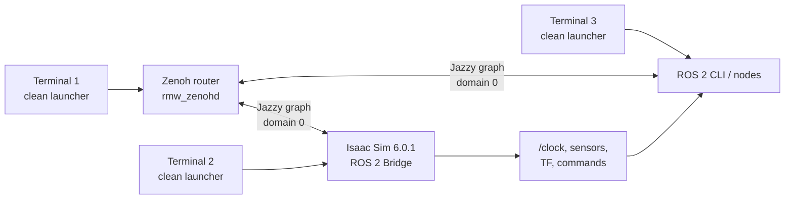
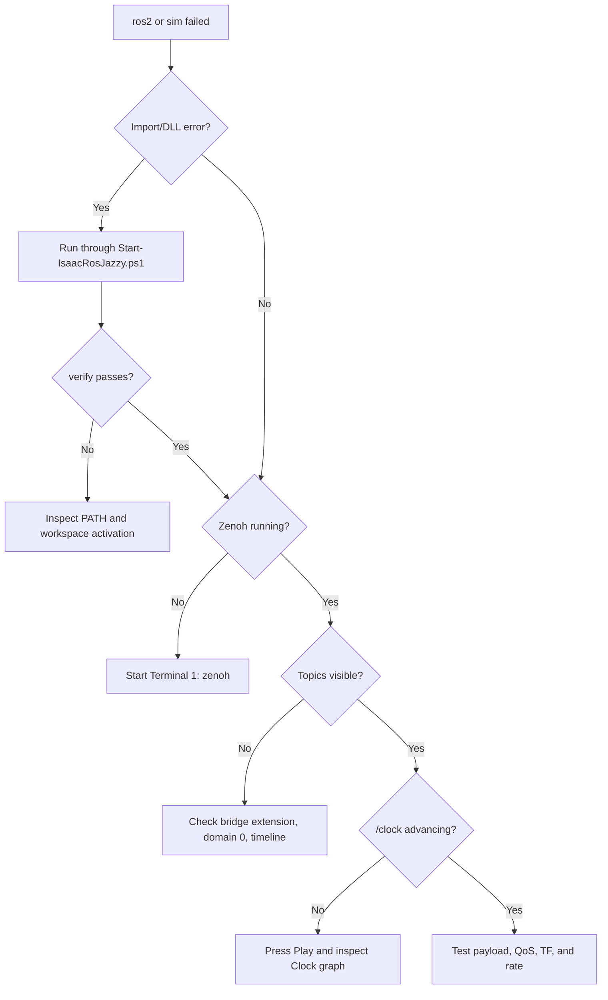

# Windows ROS 2 Jazzy + Pixi + Zenoh for Isaac Sim 6.0.1

This is the reproducible native-Windows setup for this workstation. It keeps ROS 2 Jazzy, its build tools, NVIDIA interfaces, and Zenoh inside a Pixi environment instead of mixing them with Conda, WSL, or a global ROS installation.

- Public architecture and switching guide: <https://buicongnguyen.github.io/robotics-simulation-engineer/ros2-dual-mode.html>
- Practical Lab 01–10 learning path: <https://buicongnguyen.github.io/robotics-simulation-engineer/ros2-labs.html>
- Detailed GUI Clock reproduction lab: <https://buicongnguyen.github.io/robotics-simulation-engineer/isaac-sim-gui-clock-test.html>
- GUI Clock lab Markdown: <https://github.com/buicongnguyen/buicongnguyen.github.io/blob/main/robotics-simulation-engineer/isaac-sim-gui-clock-test.md>
- NVIDIA platform instructions: <https://docs.isaacsim.omniverse.nvidia.com/latest/installation/install_ros_other_platforms.html>
- NVIDIA ROS workspaces: <https://github.com/isaac-sim/IsaacSim-ros_workspaces>
- ROS 2 Jazzy tutorials: <https://docs.ros.org/en/jazzy/Tutorials.html>

## Installed state on 3 August 2026

| Item | Installed result |
|---|---|
| Isaac Sim | `C:\isaacsim-6.0.1`, build `6.0.1-rc.7+release.42383.32955d8d.gl` |
| Pixi | `0.75.0` at `C:\Users\n\AppData\Local\pixi\bin\pixi.exe` |
| NVIDIA workspace | `C:\IsaacSim-ros_workspaces`, commit `dd3eeede7912755996a18f4884285d9f50843f79` |
| ROS workspace | `C:\IsaacSim-ros_workspaces\jazzy_ws` |
| ROS / RMW / domain | Jazzy / `rmw_zenoh_cpp` / `0` |
| Build | 16 packages completed successfully |
| Custom interfaces | `isaac_ros2_messages` resolves from the built `install` tree |
| Discovery | `rmw_zenohd.exe` launched; a ROS CLI process connected successfully |
| Disk used by workspace | approximately 28.6 GB; total free-space reduction was approximately 31 GB including caches |
| EULA gate | accepted by the user; compatibility and simulator launches now proceed |

The upstream manifest emits a deprecation warning for `[system-requirements]`, and some packages emit CMake/setuptools warnings. They did not fail the installation or build.

## Mental model



Pixi owns package resolution and activation. Zenoh owns discovery and transport. Isaac Sim owns simulation time and simulated truth. Your ROS nodes consume or command that truth.

## Why the clean launcher is required on this PC

The normal workstation `PATH` contains libraries from Conda, CUDA versions, camera SDKs, and machine-vision software. A dependency isolation test found two independent DLL collisions:

- `C:\Users\n\miniconda3\Library\bin`
- `C:\Program Files\Cognex\VisionPro\bin`

When either is inherited, `ros2` can fail while importing `_rclpy_pybind11` with “The specified procedure could not be found.” The provided launcher removes those entries only inside the ROS process tree. It does **not** uninstall or globally modify Conda or VisionPro.

Use this launcher for every native ROS terminal:

```powershell
$Launcher = "C:\Users\n\source\repos\issac_sim\robotics-simulation-engineer\Start-IsaacRosJazzy.ps1"
pwsh -NoProfile -ExecutionPolicy Bypass -File $Launcher verify
```

Expected final line:

```text
PASS: Jazzy, Zenoh, and NVIDIA custom interfaces load in a clean process.
```

## Reinstall from zero

These steps are recorded for recovery. They are already complete on this PC.

```powershell
winget install --id prefix-dev.pixi --exact --accept-package-agreements --accept-source-agreements
git clone --recurse-submodules https://github.com/isaac-sim/IsaacSim-ros_workspaces.git C:\IsaacSim-ros_workspaces
Set-Location C:\IsaacSim-ros_workspaces\jazzy_ws
```

In `pixi.toml`, set the Windows activation block to the actual local simulator path:

```toml
[target.win.activation]
scripts = ["install\\setup.bat"]
env = { isaac_sim_package_path = "C:\\isaacsim-6.0.1", PATH = "%isaac_sim_package_path%\\kit\\python\\lib;%PATH%" }
```

Then install and build from a terminal whose conflicting PATH entries have been removed:

```powershell
$env:PATH = (($env:PATH -split ";") | Where-Object {
    $_ -notlike "*\miniconda3*" -and
    $_ -notlike "*\Cognex\VisionPro\bin*"
}) -join ";"

Set-Location C:\IsaacSim-ros_workspaces\jazzy_ws
pixi install
pixi run build
```

## First manual launch and EULA

Run the compatibility check interactively:

```powershell
$Launcher = "C:\Users\n\source\repos\issac_sim\robotics-simulation-engineer\Start-IsaacRosJazzy.ps1"
pwsh -NoProfile -ExecutionPolicy Bypass -File $Launcher check
```

Read NVIDIA's Omniverse license prompt and type `Yes` only if you accept it. The automated installation deliberately stopped at this legal-acceptance boundary.

## Normal three-terminal workflow

For the complete GUI procedure—including graph architecture, exact acceptance checks, lifecycle testing, evidence, and boundary-by-boundary debugging—use [Reproduce the Isaac Sim GUI → ROS 2 Clock Test on Windows](isaac-sim-gui-clock-test.md).

Define the launcher separately in each fresh PowerShell terminal.

### Terminal 1 — Zenoh router

```powershell
$Launcher = "C:\Users\n\source\repos\issac_sim\robotics-simulation-engineer\Start-IsaacRosJazzy.ps1"
pwsh -NoProfile -ExecutionPolicy Bypass -File $Launcher zenoh
```

Leave it running.

### Terminal 2 — Isaac Sim

```powershell
$Launcher = "C:\Users\n\source\repos\issac_sim\robotics-simulation-engineer\Start-IsaacRosJazzy.ps1"
pwsh -NoProfile -ExecutionPolicy Bypass -File $Launcher sim
```

In Isaac Sim:

1. Open **Tools → Robotics → ROS 2 OmniGraphs → Clock**.
2. Confirm the graph creation dialog.
3. Press **Play**.

### Terminal 3 — prove the graph

```powershell
$Launcher = "C:\Users\n\source\repos\issac_sim\robotics-simulation-engineer\Start-IsaacRosJazzy.ps1"
pwsh -NoProfile -ExecutionPolicy Bypass -File $Launcher ros2 topic list
pwsh -NoProfile -ExecutionPolicy Bypass -File $Launcher ros2 topic echo /clock
```

Expected topics include `/clock`, `/parameter_events`, and `/rosout`. `/clock` values must advance while the Isaac Sim timeline plays.

## Verification ladder

Run these in order. Do not debug networking before environment identity passes.

1. `verify` — Jazzy, Zenoh, local Isaac path, and custom packages load.
2. `zenoh` — `rmw_zenohd.exe` stays alive.
3. `ros2 node list` — CLI exits without a DLL/import error.
4. `sim` — Isaac starts with the ROS 2 Bridge extension.
5. `ros2 topic list` — the bridge graph becomes visible.
6. `ros2 topic echo /clock` — simulation time advances.
7. Publish and subscribe to one bounded test message.
8. Record versions, workspace commit, topic/QoS/TF contract, and logs.

## Troubleshooting decisions



| Symptom | First check | Likely correction |
|---|---|---|
| `_rclpy_pybind11` procedure missing | Was the clean launcher used? | Remove Conda and Cognex DLL paths for this process |
| `pixi` not found | Open a new terminal or use its absolute path | `C:\Users\n\AppData\Local\pixi\bin\pixi.exe` |
| `install\setup.bat` missing | Did the build complete? | Run the launcher with `build` |
| Zenoh starts but topics are empty | Bridge and timeline | Start Isaac through `sim`, create Clock graph, press Play |
| `/clock` exists but freezes | Timeline state | Press Play and verify graph tick ownership |
| WSL Humble nodes appear unexpectedly | Mixed mode | Stop WSL/Isaac processes and use fresh terminals |

## Update without destroying the working environment

Do not delete `.pixi` or change the lockfile just because a newer package exists. First record the known-good commit and verify upstream changes:

```powershell
git -C C:\IsaacSim-ros_workspaces rev-parse HEAD
git -C C:\IsaacSim-ros_workspaces fetch origin
git -C C:\IsaacSim-ros_workspaces log --oneline HEAD..origin/main
```

Upgrade in a controlled maintenance session, rebuild, and repeat the entire verification ladder before using the new environment for portfolio evidence.
